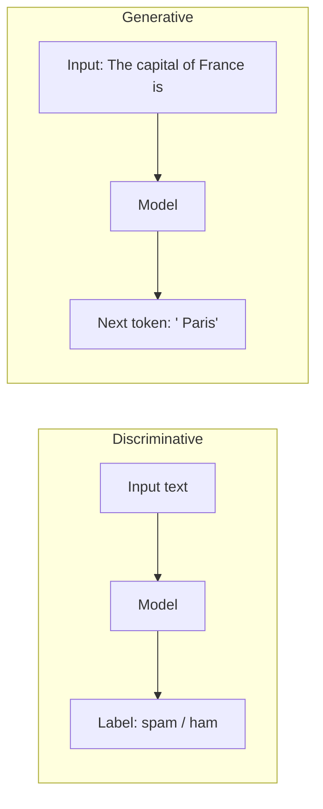

## From Classifying to Generating

In AI 101 you built a model that read an email and answered one question: *spam or ham?*
That is a **discriminative** model — it draws a boundary between categories and outputs a label.

A **generative** model answers a very different question: *given everything so far, what comes next?*
It does not pick from a fixed list of labels — it produces new content (text, code, images, audio)
that did not exist before.



{}
The surprising part: a Large Language Model is *just* a next-token predictor. Everything it does —
answering questions, writing code, summarizing documents — emerges from repeatedly predicting the
single most plausible next token, then feeding that token back in and predicting again.
{}

## What Does "Generative AI" Actually Mean?

**Generative AI (GenAI)** is the class of models that learn the *distribution* of their training
data well enough to produce new samples from it. For language, that means learning the probability
of the next token given the previous ones:

```math
$$
P(\text{token}_t \mid \text{token}_1, \text{token}_2, \dots, \text{token}_{t-1})
$$
```

If a model can estimate this probability accurately for any context, it can generate fluent text by
sampling from it over and over. That is the entire premise of an LLM.

## Large Language Model (LLM)

A **Large Language Model** is a generative model that is:

- **Large** — billions of parameters (the model you build here has thousands, so it trains in minutes)
- **Language** — trained on huge amounts of text
- **A model** — specifically, a **decoder-only Transformer** in almost all modern cases

The architecture is the *same Transformer* you met in AI 101. The differences are:

| Aspect | AI 101 Classifier | LLM (this lab) |
| ------ | ----------------- | -------------- |
| Transformer type | Encoder | Decoder (causal/masked) |
| Objective | Predict a label | Predict the next token |
| Output | One probability (spam) | A probability for *every* token in the vocabulary |
| Attention | Sees the whole input | Can only see tokens *before* the current one |
| Use | Classify | Generate |

{}
Keep this table in mind for the whole lab. Almost every "magic" property of LLMs traces back to
two design choices: **next-token prediction** as the objective, and **causal (masked) attention**
so the model can't cheat by looking at the future.
{}

## Why This Matters for Security Professionals

Understanding *how* the model generates explains its failure modes:

- It generates plausible text, not *true* text — this is why **hallucination** exists.
- It has no memory of facts beyond its training data — this is why **grounding / RAG** exists.
- It will follow instructions embedded in text it reads — this is why **prompt injection** exists.

We will return to each of these once you have built the model and can see exactly where they come from.
