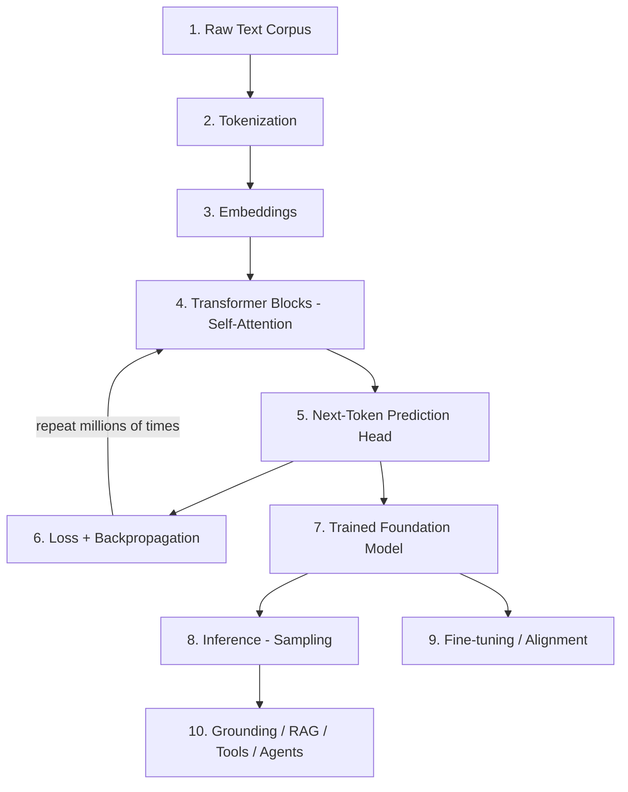

Before we write any code, here is the complete journey from a pile of raw text to a model that
generates language. Every phase of this lab maps to one box in this diagram.

## The Three Stages of an LLM's Life

### Stage 1 — Pre-training (building the foundation model)

The model is shown enormous amounts of text and learns *only one task*: predict the next token.
There are no human labels — the next token in the text **is** the label. This is called
**self-supervised learning**. The result is a **foundation model**: a general-purpose engine that
has absorbed grammar, facts, reasoning patterns and style from its training data.

- **Cost:** the expensive part. GPT-class models cost millions of dollars and weeks of GPU time.
- **Data:** trillions of tokens (web text, books, code).
- **Output:** a "base model" that completes text but isn't yet helpful or safe.

### Stage 2 — Fine-tuning & alignment (making it useful)

The raw foundation model is good at completing text but not at *following instructions* or
*being helpful and harmless*. Two common techniques:

- **Supervised Fine-Tuning (SFT):** train further on example *(instruction → good answer)* pairs.
- **Reinforcement Learning from Human Feedback (RLHF):** humans rank model outputs; the model is
  nudged toward the preferred ones.

### Stage 3 — Inference (using it)

This is what happens every time you send a prompt. The model runs forward, produces a probability
distribution over the next token, a token is **sampled**, appended, and the process repeats until a
stop condition. Around inference we bolt on **grounding, RAG, tools, and agents** to make the model
do useful work with real, current data.

{}
In this lab you will personally do **Stage 1** (pre-train a tiny foundation model from scratch) and
**Stage 3** (run inference with different sampling strategies). We will *explain* Stage 2 and the
surrounding ecosystem in Phase 5, because doing real fine-tuning and RLHF requires far more compute
than a free Colab session provides.
{}

## What You Will Have Built by the End

A working, if tiny, GPT. It will be trained on a text corpus and will generate new text in the style
of that corpus, token by token, using exactly the same principles as the models behind ChatGPT,
Claude and Gemini — only smaller.

<!-- Renders the Mermaid diagrams on this page.
     The fortinet-hugo image sets `mermaid = false` in its generated hugo.toml, which in
     Relearn 8 disables the theme's Mermaid dependency entirely: the diagram markup is
     emitted, but no Mermaid library is ever loaded and the theme's CSS keeps every
     .mermaid block at `visibility: hidden`. Remove this block once the image is fixed. -->

