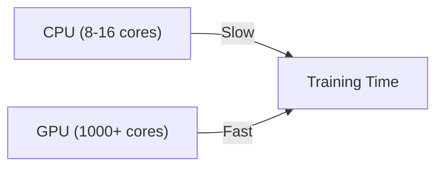

## Setup Google Colab

As in AI 101, this lab uses [Google Colab](https://colab.google/). It gives you free GPU access,
zero installation overhead, and an interactive notebook interface.

{}
If you completed AI 101 you already know this workflow. If not: Colab is a free, browser-based
Jupyter notebook environment from Google. You need a Google account (corporate or private).
{}

1. Go to https://colab.research.google.com/
2. Sign in with your Google account.
3. Select `+ New notebook`.
4. You now have a notebook to follow along with this lab.

{}
In every step you will find code snippets starting with `#@title ...`. Copy and paste these into a
code cell in your Colab notebook to run them. Snippets *without* `#@title` are for explanation only
and do not need to be copied.
{}

{}
If your session expires or times out, you will need to re-run the code from the beginning to
reinstall dependencies and re-initialize everything.
{}

## Setup dependencies

The software stack for this lab is intentionally the same family you used in AI 101, so nothing
new to learn on the tooling side:

- **TensorFlow / Keras** — model building, automatic differentiation, GPU compute
- **NumPy** — numerical operations
- **Matplotlib** — plotting training curves
- **HuggingFace Datasets** — loading a text corpus to train on

```python
#@title Setup dependencies
!pip install -q datasets

import os
import re
import numpy as np
import matplotlib.pyplot as plt

import tensorflow as tf
from tensorflow import keras
from tensorflow.keras import layers

from datasets import load_dataset
```

### Validate if a GPU is available

A generative model trains with the same millions of matrix multiplications as any deep network, so
a GPU helps a lot:



```python
#@title Check GPU
device_name = tf.test.gpu_device_name()
if device_name:
    print("✅ GPU available:", device_name)
else:
    print("⚠️ No GPU detected. Training will still work, but slower.")
```

{}
The free version of Colab does not guarantee a GPU. If none is detected, try
`Runtime` -> `Change runtime type` -> `GPU`. You can continue without a GPU, but training will be
slower. The tiny model in this lab still trains in a few minutes on CPU.
{}
