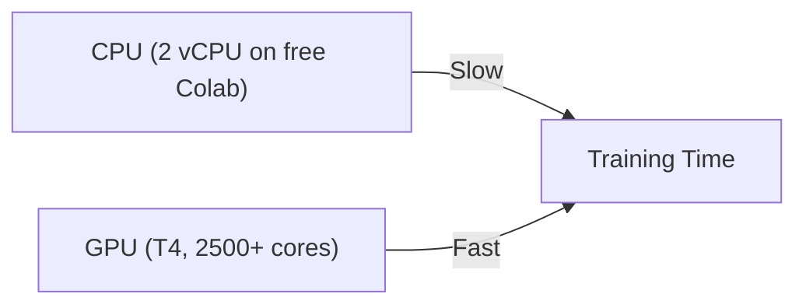
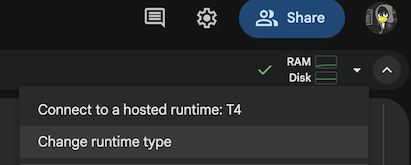
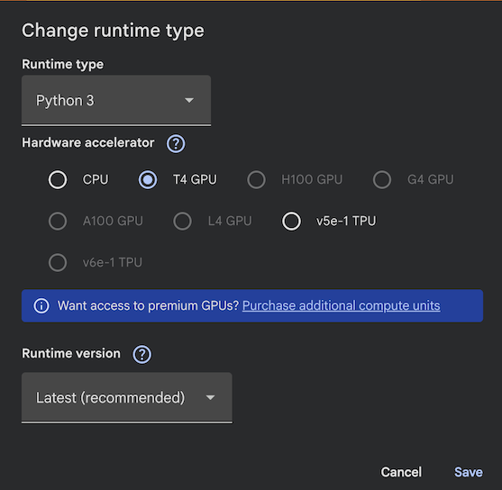

## Setup Google Colab

As in AI 301, this lab uses [Google Colab](https://colab.google/). It gives you free GPU access,
zero installation overhead, and an interactive notebook interface.

{}
If you completed AI 301 you already know this workflow. If not: Colab is a free, browser-based
Jupyter notebook environment from Google. You need a Google account (corporate or private).
The step-by-step screenshots are in the
[AI 301 setup page](https://fortinetcloudcse.github.io/genai-creator-lab/00introduction/preparation/).
{}

1. Go to https://colab.research.google.com/
2. Login to Google Colab by selecting the `Sign In` button at the top right corner


3. Select `+ New notebook` in the Wizard


4. Now you should be able to access the Jupyter Notebook which allows to follow along with the lab.


{}
If you have strict blocking of site cookies, you may have an issue running the JavaScript necessary
to run the Colab pages and render graphs. You may have to temporarily change your cookie settings in
your browser.
{}

{}
In every step you will find code snippets starting with `#@title ...`. Copy and paste these into a
code cell in your Colab notebook to run them. Snippets *without* `#@title` are for explanation only
and do not need to be copied.
{}

{}
If your session expires or times out, you will need to re-run the code from the beginning to
re-initialize everything — including the training run.
{}

## Enable the GPU *before* you start

Training a generative model is the same millions of matrix multiplications as any deep network, so
a GPU helps a lot:



Switch the runtime **now**, before you build anything — changing it later restarts the runtime and
wipes every variable you created:

1. `Runtime` -> `Change runtime type`


2. Hardware accelerator: **T4 GPU**


3. `Save`

## Setup dependencies

The software stack is the same one you used in AI 301, so there is nothing new to learn on the
tooling side:

- **TensorFlow / Keras 3** — model building, automatic differentiation, GPU compute
- **NumPy** — numerical operations
- **Matplotlib** — plotting training curves

Everything we need is already pre-installed in Colab, so there is nothing to `pip install`.

```python
#@title Setup dependencies
import os
import time
import numpy as np
import matplotlib.pyplot as plt

import tensorflow as tf
import keras
from keras import layers, ops

print("TensorFlow:", tf.__version__)
print("Keras     :", keras.__version__)
```

{}
Colab ships **Keras 3**. Keras 3 is stricter than the Keras 2 API you may have seen in older
tutorials: inside a functional model you must use `keras.ops` (imported above as `ops`) instead of
raw `tf.*` functions. Every code block in this lab is written for Keras 3 — if you copy code from an
older blog post you will likely hit `A KerasTensor cannot be used as input to a TensorFlow function`.
{}

### Validate that a GPU is available

```python
#@title Check GPU
gpus = tf.config.list_physical_devices("GPU")
if gpus:
    print("✅ GPU available:", gpus[0].name)
else:
    print("⚠️ No GPU detected. Training will still work, but roughly 5-10x slower.")
```

{}
The free version of Colab does not guarantee a GPU. If none is detected, go back to
`Runtime` -> `Change runtime type` and select `T4 GPU`. GPU availability may still be limited by
demand. You can complete the whole lab on CPU — the training run in Phase 3 then takes roughly
15-25 minutes instead of 3-5 minutes, so reduce the `steps` parameter if you are short on time.
{}

<!-- Renders the Mermaid diagrams on this page.
     The fortinet-hugo image sets `mermaid = false` in its generated hugo.toml, which in
     Relearn 8 disables the theme's Mermaid dependency entirely: the diagram markup is
     emitted, but no Mermaid library is ever loaded and the theme's CSS keeps every
     .mermaid block at `visibility: hidden`. Remove this block once the image is fixed. -->
<script type="module">
  import mermaid from "https://cdn.jsdelivr.net/npm/mermaid@11/dist/mermaid.esm.min.mjs";
  if (!window.__ftntMermaidLoaded) {
    window.__ftntMermaidLoaded = true;
    mermaid.initialize({ startOnLoad: false, securityLevel: "loose", theme: "default" });
    for (const el of document.querySelectorAll("pre.mermaid")) {
      try {
        await mermaid.run({ nodes: [el] });
      } catch (e) {
        console.error("Mermaid failed to render a diagram on this page:", e);
      }
      // Relearn only un-hides a diagram once its own script adds .mermaid-render.
      el.classList.add("mermaid-render");
    }
  }
</script>
