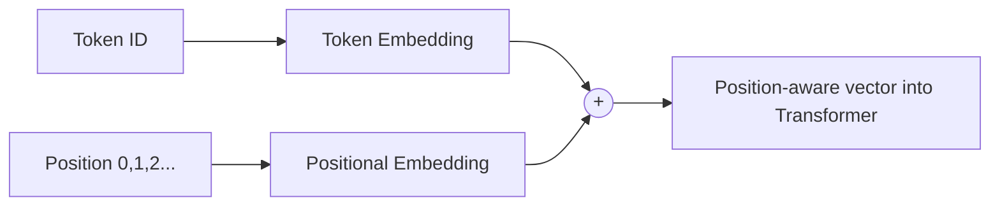

## From Integers to Meaning

A token ID like `42` is just an arbitrary label — the number itself carries no meaning, and `42` is
not "twice as much" as `21`. We need to convert each ID into a **vector** that the model can shape
during training, so that *similar tokens end up with similar vectors*. That vector is called an
**embedding**.

You already met embeddings in AI 301 — there your model learned 10-dimensional embeddings specialized
for spam semantics (urgency, reward, threat). Here the idea is identical, but the embeddings will
specialize for *whatever comes next* in the corpus.

```python
#@title See what an embedding layer does
demo_embed_dim = 64          # size of each token's vector

demo_embedding = layers.Embedding(input_dim=vocab_size, output_dim=demo_embed_dim)

example_ids = np.array([encode("To be")])     # 5 characters: T, o, space, b, e
example_vectors = demo_embedding(example_ids)

print("Input IDs shape :", example_ids.shape)        # (1, 5)
print("Embedded shape  :", example_vectors.shape)    # (1, 5, 64)
```

Each of the 5 tokens is now a 64-number vector. These numbers start random and are **learned** during
training, exactly like every other weight in the network.

## Why We Also Need *Position*

Here is a subtlety unique to Transformers. Self-attention (next chapter) looks at all tokens **at
once, in parallel** — which is what makes it fast — but that also means it has *no inherent sense of
order*. To the raw attention mechanism, "dog bites man" and "man bites dog" look the same.

We fix this by adding a **positional encoding**: a second vector that depends only on *where* a token
sits in the sequence. Adding it to the token embedding gives the model both *what* the token is and
*where* it is.



## Build the Embedding Layer

We wrap both embeddings in one custom Keras layer. This is not cosmetic: computing the position
indices needs the *actual* sequence length, and in Keras 3 that kind of computation must happen
inside a layer's `call()` — not in the middle of a functional model.

```python
#@title Combined token + position embedding layer
block_size = 128   # maximum context length the model can see at once

@keras.saving.register_keras_serializable()
class TokenAndPositionEmbedding(layers.Layer):
    def __init__(self, vocab_size, block_size, embed_dim, **kwargs):
        super().__init__(**kwargs)
        self.vocab_size = vocab_size
        self.block_size = block_size
        self.embed_dim  = embed_dim
        self.token_emb = layers.Embedding(vocab_size, embed_dim)
        self.pos_emb   = layers.Embedding(block_size, embed_dim)

    def build(self, input_shape):
        self.token_emb.build(input_shape)
        self.pos_emb.build(input_shape)
        super().build(input_shape)

    def call(self, ids):
        seq_len = ops.shape(ids)[1]
        positions = ops.arange(0, seq_len, 1)
        return self.token_emb(ids) + self.pos_emb(positions)

    def get_config(self):
        config = super().get_config()
        config.update(vocab_size=self.vocab_size,
                      block_size=self.block_size,
                      embed_dim=self.embed_dim)
        return config


# Quick check
embedding_demo = TokenAndPositionEmbedding(vocab_size, block_size, demo_embed_dim)
print("Position-aware embedding shape:", embedding_demo(example_ids).shape)   # (1, 5, 64)
```

{}
Two Keras 3 details worth understanding, because they come back in every custom layer in this lab:

- **`ops.shape` / `ops.arange` instead of `tf.shape` / `tf.range`.** `keras.ops` is Keras 3's
  backend-independent math API. Raw TensorFlow functions cannot be applied to the symbolic tensors
  Keras uses while it assembles a model.
- **`get_config()` plus `@keras.saving.register_keras_serializable()`.** Without them Keras can save
  your model but cannot *load it back* — it no longer knows which arguments to rebuild your layer
  with. You will save and reload your model at the end of Phase 3, so we get this right from the
  start.
{}

{}
**`block_size`** (also called the *context window*) is one of the most important numbers in any LLM.
It is the maximum number of tokens the model can attend to at once. When you hear that a model has a
"128k context window," this is that parameter — scaled up enormously. A bigger context window lets
the model use more of your prompt and documents, but costs more memory and compute, because attention
scales with the *square* of the sequence length.
{}

{}
`demo_embed_dim` and `demo_embedding` exist only to make this page's output visible. The real
`embed_dim` used by your model is set with the other hyperparameters in Phase 3 — that is the one to
change when you tune the model in the final challenge.
{}

{}
You now have everything needed to feed text into a Transformer: tokens → embeddings → position-aware
vectors. The next phase builds the part that does the actual *thinking*: self-attention.
{}

<!-- Renders the Mermaid diagrams on this page.
     The fortinet-hugo image sets `mermaid = false` in its generated hugo.toml, which in
     Relearn 8 disables the theme's Mermaid dependency entirely: the diagram markup is
     emitted, but no Mermaid library is ever loaded and the theme's CSS keeps every
     .mermaid block at `visibility: hidden`. Remove this block once the image is fixed. -->
<script type="module">
  import mermaid from "https://cdn.jsdelivr.net/npm/mermaid@11/dist/mermaid.esm.min.mjs";
  if (!window.__ftntMermaidLoaded) {
    window.__ftntMermaidLoaded = true;
    mermaid.initialize({ startOnLoad: false, securityLevel: "loose", theme: "default" });
    for (const el of document.querySelectorAll("pre.mermaid")) {
      try {
        await mermaid.run({ nodes: [el] });
      } catch (e) {
        console.error("Mermaid failed to render a diagram on this page:", e);
      }
      // Relearn only un-hides a diagram once its own script adds .mermaid-render.
      el.classList.add("mermaid-render");
    }
  }
</script>
