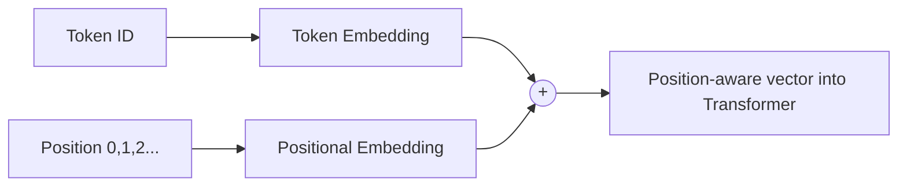

## From Integers to Meaning

A token ID like `42` is just an arbitrary label — the number itself carries no meaning, and `42`
is not "twice as much" as `21`. We need to convert each ID into a **vector** that the model can
shape during training so that *similar tokens end up with similar vectors*. That vector is called an
**embedding**.

You already met embeddings in AI 101 — there your model learned 10-dimensional embeddings
specialized for spam semantics (urgency, reward, threat). Here the idea is identical, but the
embeddings will specialize for *whatever comes next* in the corpus.

```python
#@title Define an embedding layer
embed_dim = 64          # size of each token's vector
token_embedding = layers.Embedding(input_dim=vocab_size, output_dim=embed_dim)

example_ids = tf.constant([encode("To be")])
example_vectors = token_embedding(example_ids)
print("Input IDs shape :", example_ids.shape)        # (1, 5)
print("Embedded shape  :", example_vectors.shape)     # (1, 5, 64)
```

Each of the 5 tokens is now a 64-number vector. These numbers start random and are **learned** during
training, exactly like every other weight in the network.

## Why We Also Need *Position*

Here is a subtlety unique to Transformers. Self-attention (next chapter) looks at all tokens **at
once, in parallel** — which is what makes it fast — but that also means it has *no inherent sense of
order*. To the raw attention mechanism, "dog bites man" and "man bites dog" look the same.

We fix this by adding a **positional encoding**: a second vector that depends only on *where* a token
sits in the sequence. Adding it to the token embedding gives the model both *what* the token is and
*where* it is.



```python
#@title Add a learned positional embedding
block_size = 128   # maximum context length the model can see at once
position_embedding = layers.Embedding(input_dim=block_size, output_dim=embed_dim)

def embed_sequence(ids):
    seq_len = tf.shape(ids)[1]
    positions = tf.range(start=0, limit=seq_len, delta=1)
    return token_embedding(ids) + position_embedding(positions)

out = embed_sequence(example_ids)
print("Position-aware embedding shape:", out.shape)   # (1, 5, 64)
```

{}
**`block_size`** (also called the *context window*) is one of the most important numbers in any LLM.
It is the maximum number of tokens the model can attend to at once. When you hear that a model has a
"128k context window," this is that parameter — scaled up enormously. A bigger context window lets
the model use more of your prompt and documents, but costs more memory and compute (attention scales
with the *square* of the sequence length).
{}

{}
You now have everything needed to feed text into a Transformer: tokens → embeddings → position-aware
vectors. The next phase builds the part that does the actual *thinking*: self-attention.
{}
