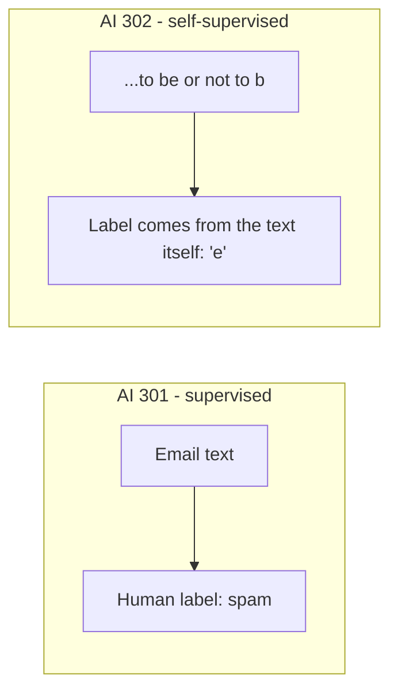

## Why an LLM Needs a Corpus, Not Labels

In AI 301 every email came with a **label** (spam/ham) that a human had assigned. Training a
generative model needs no labels at all — the text is its own supervision. The "correct answer" for
any position is simply *the token that actually came next* in the real text. This is what makes LLM
training **self-supervised**, and it is why models can be trained on essentially the whole internet
without anyone hand-labeling it.



## Load a Small Corpus

We use **Tiny Shakespeare** — a single public-domain text file of about 1.1 million characters. It is
small enough to train on in minutes, and stylistically consistent enough that you can *see* the model
learning: first spelling, then words, then the shape of a play.

```python
#@title Load the Tiny Shakespeare corpus
CORPUS_URL = "https://raw.githubusercontent.com/karpathy/char-rnn/master/data/tinyshakespeare/input.txt"

corpus_path = keras.utils.get_file("tinyshakespeare.txt", CORPUS_URL)
with open(corpus_path, "r", encoding="utf-8") as f:
    text = f.read()

print("Corpus length (characters):", len(text))
print("\n--- First 300 characters ---\n")
print(text[:300])
```

You should see `Corpus length (characters): 1115394`.

{}
You can swap in any plain-text corpus you like — a book, your own documentation, log files, even
Python source code. Point `CORPUS_URL` at any raw text file, or upload your own file to Colab and
read it instead. The model will learn to generate text in the style of whatever you feed it: **the
corpus *is* the personality of your model.** Keep it above ~500,000 characters, otherwise there is
too little signal to learn from.
{}

## Inspect the Vocabulary

Before tokenizing, let's see what raw symbols the corpus contains. For a character-level model the
"vocabulary" is just the set of unique characters.

```python
#@title Inspect the character vocabulary
chars = sorted(set(text))
vocab_size = len(chars)

print("Number of unique characters (vocab size):", vocab_size)
print("Characters:", "".join(chars))
```

For Tiny Shakespeare this prints `65` — 26 lowercase letters, 26 uppercase, a newline, a space and a
handful of punctuation marks. That is the model's entire universe of symbols.

{}
We use **character-level** tokenization in this lab because it is the easiest to see and reason
about: the vocabulary is tiny (65 symbols) and nothing is hidden. Real LLMs use **subword**
tokenization (Byte-Pair Encoding, WordPiece, SentencePiece), which strikes a balance between
character-level (sequences far too long) and word-level (vocabulary far too large, and helpless
against words it never saw). The *principle* — text becomes a sequence of integers — is identical.
We cover subword tokenization on the next page.
{}

<!-- Renders the Mermaid diagrams on this page.
     The fortinet-hugo image sets `mermaid = false` in its generated hugo.toml, which in
     Relearn 8 disables the theme's Mermaid dependency entirely: the diagram markup is
     emitted, but no Mermaid library is ever loaded and the theme's CSS keeps every
     .mermaid block at `visibility: hidden`. Remove this block once the image is fixed. -->
<script type="module">
  import mermaid from "https://cdn.jsdelivr.net/npm/mermaid@11/dist/mermaid.esm.min.mjs";
  if (!window.__ftntMermaidLoaded) {
    window.__ftntMermaidLoaded = true;
    mermaid.initialize({ startOnLoad: false, securityLevel: "loose", theme: "default" });
    for (const el of document.querySelectorAll("pre.mermaid")) {
      try {
        await mermaid.run({ nodes: [el] });
      } catch (e) {
        console.error("Mermaid failed to render a diagram on this page:", e);
      }
      // Relearn only un-hides a diagram once its own script adds .mermaid-render.
      el.classList.add("mermaid-render");
    }
  }
</script>
