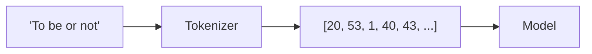

## What Is a Token?

A **token** is the atomic unit a language model reads and writes. Tokenization is the process of
splitting text into these units and mapping each one to an integer ID. The model never sees letters
or words — only sequences of token IDs.



There are three common granularities:

| Granularity | Example for "tokenization" | Pros | Cons |
| ----------- | -------------------------- | ---- | ---- |
| Character | t,o,k,e,n,i,z,a,t,i,o,n | Tiny vocab, handles anything | Very long sequences, no word meaning |
| Word | tokenization | Short sequences, intuitive | Huge vocab, fails on unseen words |
| Subword (BPE) | token, ization | Balanced; handles new words | Slightly more complex to build |

{}
Production LLMs use **subword** tokenization, almost always **Byte-Pair Encoding (BPE)**. BPE starts
from characters and repeatedly merges the most frequent adjacent pair into a new token. Common words
become single tokens; rare words get split into pieces. This is why a ChatGPT prompt of ~750 English
words is roughly ~1000 tokens, and why you are billed *per token*.
{}

## Build a Character-Level Tokenizer

For clarity we build the simplest possible tokenizer: a lookup table from character to integer and
back.

```python
#@title Build the char <-> int mappings
stoi = {ch: i for i, ch in enumerate(chars)}   # string-to-integer
itos = {i: ch for i, ch in enumerate(chars)}   # integer-to-string

def encode(s):
    """Turn a string into a list of token IDs."""
    return [stoi[c] for c in s]

def decode(ids):
    """Turn a list of token IDs back into a string."""
    return "".join(itos[i] for i in ids)

# Quick sanity check
sample = "To be, or not to be"
print("Original:", sample)
print("Encoded :", encode(sample))
print("Decoded :", decode(encode(sample)))
```

## Encode the Entire Corpus

Now convert the whole corpus into one long array of token IDs. This array is the raw material the
training loop will slice into examples.

```python
#@title Encode the full corpus into a tensor
data = tf.constant(encode(text), dtype=tf.int32)
print("Encoded corpus shape:", data.shape)
print("First 50 token IDs:", data[:50].numpy())
```

{}
Notice there is still **no label column** anywhere. The next page builds embeddings; the page after
that shows the trick that turns this single stream of tokens into millions of training examples — by
asking the model to predict each token from the ones before it.
{}
