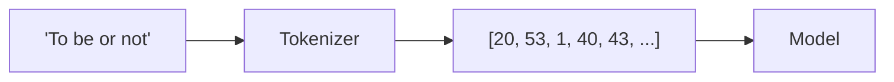

## What Is a Token?

A **token** is the atomic unit a language model reads and writes. Tokenization is the process of
splitting text into these units and mapping each one to an integer ID. The model never sees letters
or words — only sequences of token IDs.



There are three common granularities:

| Granularity | Example for "tokenization" | Pros | Cons |
| ----------- | -------------------------- | ---- | ---- |
| Character | t,o,k,e,n,i,z,a,t,i,o,n | Tiny vocab, handles anything | Very long sequences, no word meaning |
| Word | tokenization | Short sequences, intuitive | Huge vocab, fails on unseen words |
| Subword (BPE) | token, ization | Balanced; handles new words | Slightly more complex to build |

{}
Production LLMs use **subword** tokenization, almost always **Byte-Pair Encoding (BPE)**. BPE starts
from characters and repeatedly merges the most frequent adjacent pair into a new token. Common words
become single tokens; rare words get split into pieces. This is why a ChatGPT prompt of ~750 English
words is roughly ~1000 tokens, and why you are billed *per token*.
{}

## Build a Character-Level Tokenizer

For clarity we build the simplest possible tokenizer: a lookup table from character to integer and
back.

```python
#@title Build the char <-> int mappings
stoi = {ch: i for i, ch in enumerate(chars)}   # string-to-integer
itos = {i: ch for i, ch in enumerate(chars)}   # integer-to-string

def encode(s):
    """Turn a string into a list of token IDs."""
    return [stoi[c] for c in s]

def decode(ids):
    """Turn a list of token IDs back into a string."""
    return "".join(itos[int(i)] for i in ids)

# Quick sanity check
sample = "To be, or not to be"
print("Original:", sample)
print("Encoded :", encode(sample))
print("Decoded :", decode(encode(sample)))
```

## Encode the Entire Corpus

Now convert the whole corpus into one long array of token IDs. This array is the raw material the
training loop will slice into examples.

```python
#@title Encode the full corpus
data = np.array(encode(text), dtype=np.int32)

print("Encoded corpus shape:", data.shape)
print("First 50 token IDs :", data[:50])
print("Decoded again      :", repr(decode(data[:50])))
```

We keep the corpus as a plain NumPy array rather than a TensorFlow tensor, because the training loop
will cut millions of random slices out of it and NumPy indexing is much faster for that.

## Hold Out a Validation Split

Exactly as in AI 301, we keep part of the data away from training so we can measure whether the model
**generalizes** or merely **memorizes**. For a language model the split is positional: the first 90%
of the text is used for training, the last 10% is never shown to the model during training.

```python
#@title Train / validation split
n = int(0.9 * len(data))
train_data = data[:n]
val_data   = data[n:]

print("Train tokens:", len(train_data))
print("Val   tokens:", len(val_data))
```

{}
Everything from here on trains on `train_data` only. `val_data` is used exactly twice: to watch for
overfitting during training, and to score your model in the final challenge.
{}

{}
Notice there is still **no label column** anywhere. The next page builds embeddings; the page after
that shows the trick that turns this single stream of tokens into millions of training examples — by
asking the model to predict each token from the ones before it.
{}

<!-- Renders the Mermaid diagrams on this page.
     The fortinet-hugo image sets `mermaid = false` in its generated hugo.toml, which in
     Relearn 8 disables the theme's Mermaid dependency entirely: the diagram markup is
     emitted, but no Mermaid library is ever loaded and the theme's CSS keeps every
     .mermaid block at `visibility: hidden`. Remove this block once the image is fixed. -->
<script type="module">
  import mermaid from "https://cdn.jsdelivr.net/npm/mermaid@11/dist/mermaid.esm.min.mjs";
  if (!window.__ftntMermaidLoaded) {
    window.__ftntMermaidLoaded = true;
    mermaid.initialize({ startOnLoad: false, securityLevel: "loose", theme: "default" });
    for (const el of document.querySelectorAll("pre.mermaid")) {
      try {
        await mermaid.run({ nodes: [el] });
      } catch (e) {
        console.error("Mermaid failed to render a diagram on this page:", e);
      }
      // Relearn only un-hides a diagram once its own script adds .mermaid-render.
      el.classList.add("mermaid-render");
    }
  }
</script>
