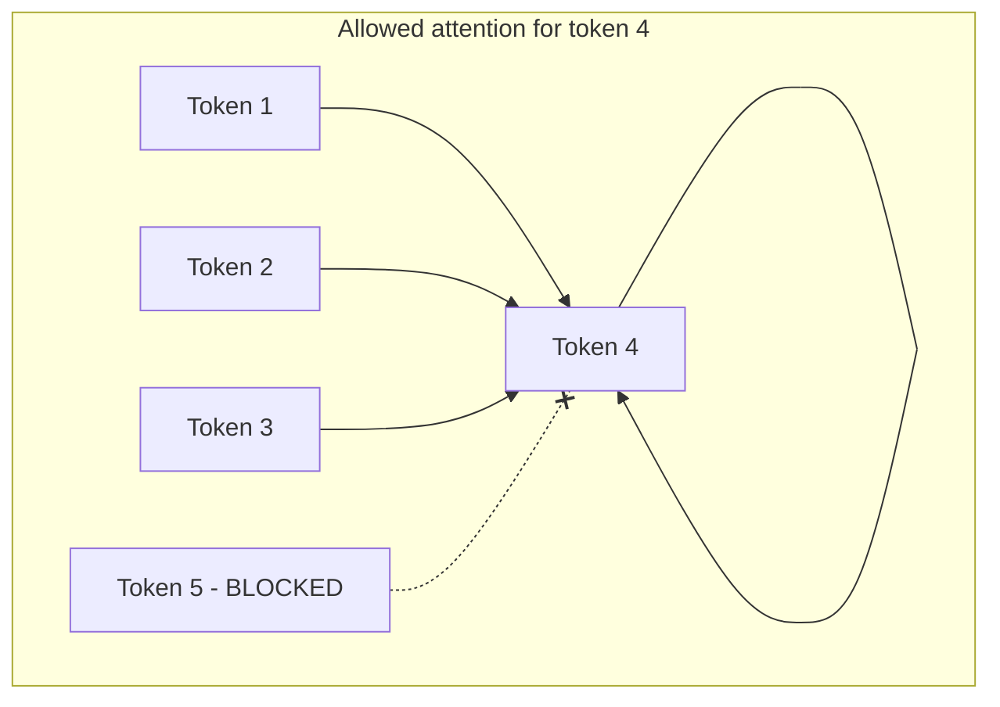

## The Single Most Important Difference vs. AI 301

The classifier in AI 301 used an **encoder**: every token could attend to every other token, in both
directions, because the whole input was available at once.

A generative model must not do that. When it is learning to predict the token at position 5, it must
**only** be allowed to look at positions 1–4. If it could peek at position 5 (or beyond), it would
"cheat" — it would just copy the answer, learn nothing, and be useless at generation time when the
future genuinely doesn't exist yet.

We enforce this with a **causal mask** (also called a *look-ahead* or *triangular* mask).



## What the Mask Looks Like

For a 5-token sequence, the mask blocks (sets to `-infinity` before softmax) every position to the
*right* of the current one. A `1` means "block this":

```text
            attend to: t1 t2 t3 t4 t5
predict t1:            0  1  1  1  1
predict t2:            0  0  1  1  1
predict t3:            0  0  0  1  1
predict t4:            0  0  0  0  1
predict t5:            0  0  0  0  0
```

After softmax, the blocked positions get weight 0, so each token's new representation depends only on
itself and the tokens before it.

```python
#@title Build a causal mask and see its effect
def causal_mask(seq_len):
    """Returns a (seq_len, seq_len) matrix: 1 where attention must be BLOCKED."""
    return 1.0 - np.tril(np.ones((seq_len, seq_len), dtype="float32"))

print("Blocked positions (1 = blocked):")
print(causal_mask(5).astype(int))

# Apply it to the hand-written attention from the previous page
demo = tf.random.normal((1, 5, 8))
_, masked_weights = scaled_dot_product_attention(demo, demo, demo, mask=causal_mask(5))
print("\nAttention weights with the mask applied:")
print(np.round(masked_weights[0].numpy(), 2))
```

The printed weight matrix is **lower-triangular**: every position above the diagonal is exactly
`0.00`. Token 1 can only attend to itself; token 5 can attend to all five. No token can see its own
future.

{}
In the real model we will not pass this matrix by hand. Keras 3's `MultiHeadAttention` layer accepts
`use_causal_mask=True`, which builds exactly this triangular mask internally and at the right shape
for every attention head. Building it manually here is so you can see there is nothing mysterious
inside that flag.
{}

{}
This one design choice — causal masking — is what makes a Transformer "decoder-only" / "autoregressive"
/ "GPT-style." **Autoregressive** simply means *each output depends on the outputs that came before
it.* Every token is predicted from its left context, then fed back in to help predict the next one.
{}

{}
The clever payoff: during *training*, the causal mask lets the model learn to predict **all positions
at once in a single forward pass** (each position only sees its own past). During *generation*, the
same mask means it can produce one token, append it, and roll forward. Same machinery, two modes.
{}

<!-- Renders the Mermaid diagrams on this page.
     The fortinet-hugo image sets `mermaid = false` in its generated hugo.toml, which in
     Relearn 8 disables the theme's Mermaid dependency entirely: the diagram markup is
     emitted, but no Mermaid library is ever loaded and the theme's CSS keeps every
     .mermaid block at `visibility: hidden`. Remove this block once the image is fixed. -->
<script type="module">
  import mermaid from "https://cdn.jsdelivr.net/npm/mermaid@11/dist/mermaid.esm.min.mjs";
  if (!window.__ftntMermaidLoaded) {
    window.__ftntMermaidLoaded = true;
    mermaid.initialize({ startOnLoad: false, securityLevel: "loose", theme: "default" });
    for (const el of document.querySelectorAll("pre.mermaid")) {
      try {
        await mermaid.run({ nodes: [el] });
      } catch (e) {
        console.error("Mermaid failed to render a diagram on this page:", e);
      }
      // Relearn only un-hides a diagram once its own script adds .mermaid-render.
      el.classList.add("mermaid-render");
    }
  }
</script>
