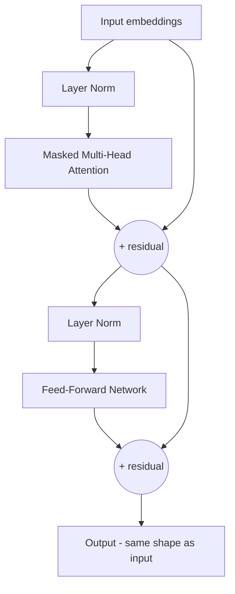

## The Repeating Unit of a GPT

A GPT is just a stack of identical **decoder blocks**. Each block has two sub-layers, each wrapped
with a **residual connection** and **layer normalization**:

1. **Masked multi-head self-attention** — tokens gather context from their past.
2. **Feed-forward network (FFN)** — a small MLP applied to each token, where most of the model's
   "knowledge" is stored.



{}
**Residual connections** (the `+` arrows) add the block's input back to its output. They let gradients
flow cleanly through very deep stacks and are the reason we can stack dozens or hundreds of blocks.
**Layer normalization** keeps the numbers in each layer in a stable range so training doesn't diverge.
You don't need to derive these — just know they are the "plumbing" that makes deep Transformers
trainable.
{}

## Build the Block in Keras

```python
#@title Define a single decoder (Transformer) block
@keras.saving.register_keras_serializable()
class DecoderBlock(layers.Layer):
    def __init__(self, embed_dim, num_heads, ff_dim, dropout_rate=0.1, **kwargs):
        super().__init__(**kwargs)
        self.embed_dim    = embed_dim
        self.num_heads    = num_heads
        self.ff_dim       = ff_dim
        self.dropout_rate = dropout_rate

        self.attn = layers.MultiHeadAttention(
            num_heads=num_heads,
            key_dim=embed_dim // num_heads,   # split the vector across the heads
        )
        self.ffn = keras.Sequential([
            layers.Dense(ff_dim, activation="gelu"),
            layers.Dense(embed_dim),
        ])
        self.ln1   = layers.LayerNormalization(epsilon=1e-6)
        self.ln2   = layers.LayerNormalization(epsilon=1e-6)
        self.drop1 = layers.Dropout(dropout_rate)
        self.drop2 = layers.Dropout(dropout_rate)

    def build(self, input_shape):
        self.ln1.build(input_shape)
        self.ln2.build(input_shape)
        self.attn.build(input_shape, input_shape, input_shape)
        self.ffn.build(input_shape)
        super().build(input_shape)

    def call(self, x, training=False):
        # 1) masked self-attention + residual
        h = self.ln1(x)
        attn_out = self.attn(query=h, value=h, key=h,
                             use_causal_mask=True,      # the triangular mask from the last page
                             training=training)
        x = x + self.drop1(attn_out, training=training)

        # 2) feed-forward + residual
        ffn_out = self.ffn(self.ln2(x))
        x = x + self.drop2(ffn_out, training=training)
        return x

    def get_config(self):
        config = super().get_config()
        config.update(embed_dim=self.embed_dim,
                      num_heads=self.num_heads,
                      ff_dim=self.ff_dim,
                      dropout_rate=self.dropout_rate)
        return config


# Sanity check: the block must return exactly the shape it was given
demo_block = DecoderBlock(embed_dim=64, num_heads=4, ff_dim=256)
print("In :", (2, 10, 64))
print("Out:", demo_block(tf.random.normal((2, 10, 64))).shape)
```

{}
Read the `call` method carefully — it is the entire Transformer in six lines. Norm, attend with a
causal mask, add back the input, norm, feed-forward, add back the input. Stack `N` of these and you
have the architecture behind every major LLM. The differences between this toy model and a frontier
model are *scale* (embed_dim, num_heads, ff_dim, number of blocks, context length, parameters) and
*data*, not a different idea.
{}

{}
**Why `key_dim = embed_dim // num_heads`?** Multi-head attention splits the token vector across its
heads rather than giving each head a full-width copy. With `embed_dim=64` and `num_heads=4`, each head
works in 16 dimensions and their outputs are concatenated back to 64. This is how the original
Transformer paper defines it, and it keeps the parameter count independent of the number of heads.
Because of this, **`num_heads` must divide `embed_dim` evenly** — remember that when you tune the
model in the final challenge.
{}

## Parameters You Will Tune Later

| Parameter | Meaning | Effect of increasing |
| --------- | ------- | -------------------- |
| `embed_dim` | size of each token vector | more capacity, slower |
| `num_heads` | parallel attention views | richer relationships (must divide `embed_dim`) |
| `ff_dim` | width of the feed-forward MLP | more "knowledge" capacity |
| `num_blocks` | how many decoder blocks stacked | deeper reasoning, slower |
| `block_size` | context window length | sees more history, much more memory |
| `dropout_rate` | fraction of activations randomly zeroed | less overfitting, slower learning |

`ff_dim`, `dropout_rate` and `batch_size` are the *same knobs* you tuned in the AI 301 final
challenge — generative and discriminative Transformers share most of their dials. What is new here is
`block_size`, which only matters when a model has to generate.

<!-- Renders the Mermaid diagrams on this page.
     The fortinet-hugo image sets `mermaid = false` in its generated hugo.toml, which in
     Relearn 8 disables the theme's Mermaid dependency entirely: the diagram markup is
     emitted, but no Mermaid library is ever loaded and the theme's CSS keeps every
     .mermaid block at `visibility: hidden`. Remove this block once the image is fixed. -->
<script type="module">
  import mermaid from "https://cdn.jsdelivr.net/npm/mermaid@11/dist/mermaid.esm.min.mjs";
  if (!window.__ftntMermaidLoaded) {
    window.__ftntMermaidLoaded = true;
    mermaid.initialize({ startOnLoad: false, securityLevel: "loose", theme: "default" });
    for (const el of document.querySelectorAll("pre.mermaid")) {
      try {
        await mermaid.run({ nodes: [el] });
      } catch (e) {
        console.error("Mermaid failed to render a diagram on this page:", e);
      }
      // Relearn only un-hides a diagram once its own script adds .mermaid-render.
      el.classList.add("mermaid-render");
    }
  }
</script>
