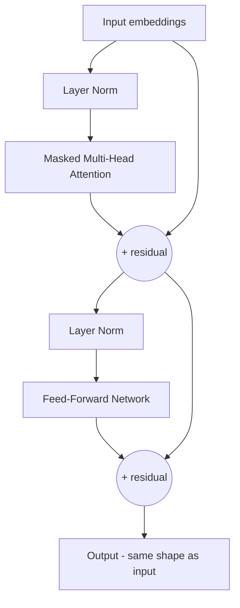

## The Repeating Unit of a GPT

A GPT is just a stack of identical **decoder blocks**. Each block has two sub-layers, each wrapped
with a **residual connection** and **layer normalization**:

1. **Masked multi-head self-attention** — tokens gather context from their past.
2. **Feed-forward network (FFN)** — a small MLP applied to each token, where most of the model's
   "knowledge" is stored.



{}
**Residual connections** (the `+` arrows) add the block's input back to its output. They let gradients
flow cleanly through very deep stacks and are the reason we can stack dozens or hundreds of blocks.
**Layer normalization** keeps the numbers in each layer in a stable range so training doesn't diverge.
You don't need to derive these — just know they are the "plumbing" that makes deep Transformers
trainable.
{}

## Build the Block in Keras

```python
#@title Define a single decoder (Transformer) block
class DecoderBlock(layers.Layer):
    def __init__(self, embed_dim, num_heads, ff_dim, dropout_rate=0.1):
        super().__init__()
        self.attn = layers.MultiHeadAttention(num_heads=num_heads, key_dim=embed_dim)
        self.ffn = keras.Sequential([
            layers.Dense(ff_dim, activation="gelu"),
            layers.Dense(embed_dim),
        ])
        self.ln1 = layers.LayerNormalization(epsilon=1e-6)
        self.ln2 = layers.LayerNormalization(epsilon=1e-6)
        self.drop1 = layers.Dropout(dropout_rate)
        self.drop2 = layers.Dropout(dropout_rate)

    def call(self, x, training=False):
        seq_len = tf.shape(x)[1]
        # causal mask: shape (seq_len, seq_len), True = attend, False = block
        mask = tf.linalg.band_part(tf.ones((seq_len, seq_len), dtype=tf.bool), -1, 0)

        # 1) masked self-attention + residual
        attn_out = self.attn(query=self.ln1(x), value=self.ln1(x),
                             key=self.ln1(x), attention_mask=mask)
        x = x + self.drop1(attn_out, training=training)

        # 2) feed-forward + residual
        ffn_out = self.ffn(self.ln2(x))
        x = x + self.drop2(ffn_out, training=training)
        return x
```

{}
Read the `call` method carefully — it is the entire Transformer in eight lines. Norm, attend with a
causal mask, add back the input, norm, feed-forward, add back the input. Stack `N` of these and you
have the architecture behind every major LLM. The differences between a toy model and GPT-4 are
*scale* (embed_dim, num_heads, ff_dim, number of blocks, context length, parameters) and *data*, not
a different idea.
{}

## Parameters You Will Tune Later

| Parameter | Meaning | Effect of increasing |
| --------- | ------- | -------------------- |
| `embed_dim` | size of each token vector | more capacity, slower |
| `num_heads` | parallel attention views | richer relationships |
| `ff_dim` | width of the feed-forward MLP | more "knowledge" capacity |
| `num_blocks` | how many decoder blocks stacked | deeper reasoning, slower |
| `block_size` | context window length | sees more history, much more memory |

Note these `dropout_rate`, `ff_dim` and friends are the *same knobs* you tuned in the AI 101 final
challenge — generative and discriminative Transformers share the same dials.
