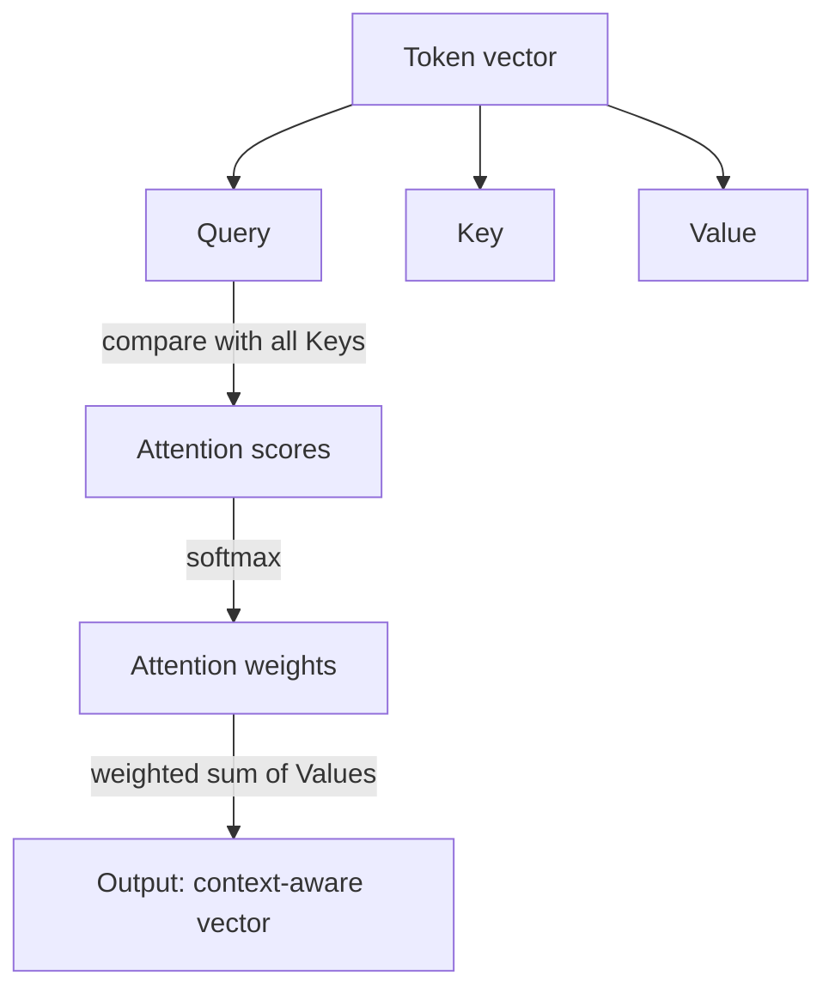
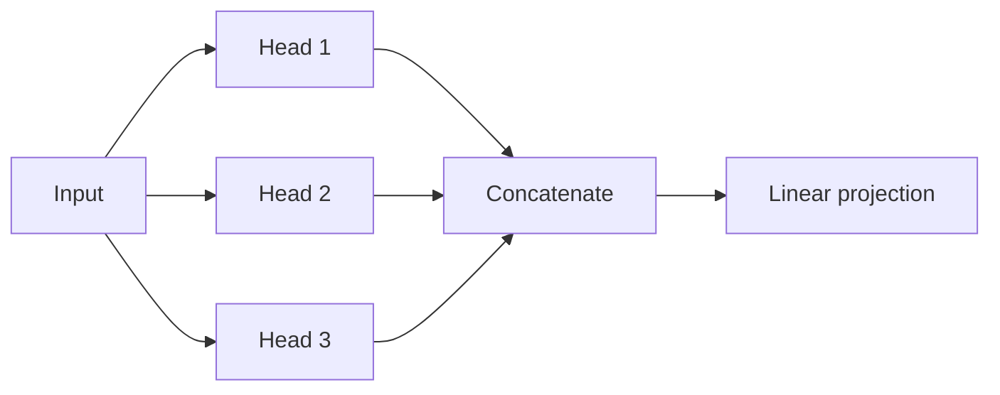

## The Core Idea

To predict the next token well, the model must decide **which earlier tokens matter right now**.
In the sentence *"The server crashed because it ran out of memory"*, to understand *"it"* the model
must look back at *"server"*. **Self-attention** is the mechanism that lets every token look at every
other token and decide how much to pay attention to each.

You saw self-attention in AI 101 at a high level. Here we open it up.

## Query, Key, Value

Every token produces three vectors, all learned:

- **Query (Q):** "what am I looking for?"
- **Key (K):** "what do I offer / what am I about?"
- **Value (V):** "what information do I pass on if attended to?"

A token's query is compared against every token's key. High similarity → high attention weight →
that token's value contributes more to the result.



## The Attention Formula

The famous equation from *"Attention Is All You Need"* (2017):

```math
$$
\mathrm{Attention}(Q, K, V) = \mathrm{softmax}\!\left(\frac{Q K^{\top}}{\sqrt{d_k}}\right) V
$$
```

In plain language:

1. **`Q Kᵀ`** — for each token, score how relevant every other token is (dot product = similarity).
2. **`/ √dₖ`** — scale down so the scores don't explode as vectors get larger.
3. **`softmax`** — turn scores into weights that sum to 1 (a probability distribution over tokens).
4. **`× V`** — take a weighted average of the value vectors. The result is each token "rewritten" in
   the context of the tokens it found relevant.

```python
#@title Scaled dot-product attention, by hand
def scaled_dot_product_attention(q, k, v, mask=None):
    # q, k, v shapes: (batch, seq_len, d_k)
    d_k = tf.cast(tf.shape(k)[-1], tf.float32)
    scores = tf.matmul(q, k, transpose_b=True) / tf.math.sqrt(d_k)   # (batch, seq, seq)
    if mask is not None:
        scores += (mask * -1e9)        # set masked positions to -infinity before softmax
    weights = tf.nn.softmax(scores, axis=-1)
    return tf.matmul(weights, v), weights
```

## Multi-Head Attention

One set of Q/K/V can only capture one kind of relationship. **Multi-head attention** runs several
attention operations in parallel, each with its own learned Q/K/V, then concatenates the results.

As in AI 101's classifier:

- Head 1 might track subject ↔ pronoun links
- Head 2 might track verb tense
- Head 3 might track topic / named entities



{}
Keras gives us a battle-tested `layers.MultiHeadAttention`, so in the actual model we will use that
rather than the hand-written version above. The hand-written version exists so you can see there is
no magic inside — it is dot products, a scale, a softmax, and a weighted sum.
{}
