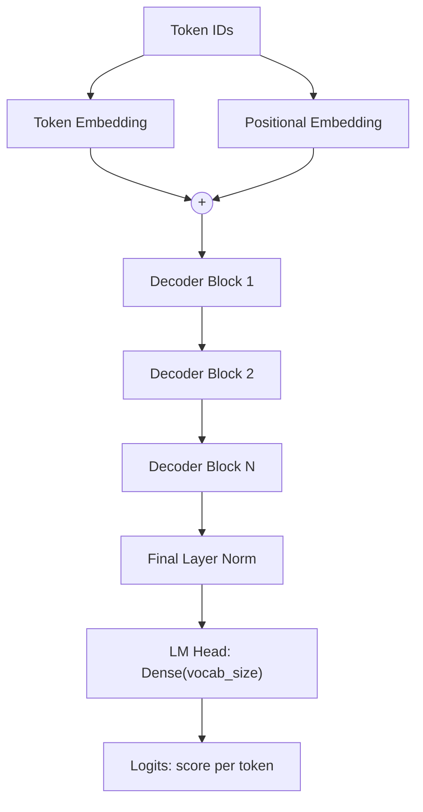

## Stack the Pieces Into a Mini-GPT

Now we connect everything: token + positional embeddings → a stack of decoder blocks → a final
linear layer (the **language-model head**) that produces a score for every token in the vocabulary.



```python
#@title Build the GPT-style model
#@title Hyperparameters - these are your tuning knobs for the challenge
embed_dim   = 64     # token/position vector size
num_heads   = 4      # parallel attention heads
ff_dim      = 256    # feed-forward width inside each block
num_blocks  = 4      # how many decoder blocks to stack
dropout_rate = 0.1
# block_size and vocab_size were defined earlier

def build_gpt():
    inputs = keras.Input(shape=(None,), dtype="int32")
    seq_len = tf.shape(inputs)[1]

    tok = layers.Embedding(vocab_size, embed_dim)(inputs)
    pos = layers.Embedding(block_size, embed_dim)(tf.range(seq_len))
    x = tok + pos

    for _ in range(num_blocks):
        x = DecoderBlock(embed_dim, num_heads, ff_dim, dropout_rate)(x)

    x = layers.LayerNormalization(epsilon=1e-6)(x)
    logits = layers.Dense(vocab_size)(x)        # one score per vocabulary token
    return keras.Model(inputs=inputs, outputs=logits)

model = build_gpt()
model.summary()
```

{}
Look at the parameter count in `model.summary()`. This toy model has on the order of hundreds of
thousands of parameters. GPT-3 has 175 **billion**. The architecture printed here and the one inside
a frontier model are the same shape — only the numbers differ.
{}

## Compile With the Right Loss

We use sparse categorical cross-entropy `from_logits=True` because our LM head outputs raw scores
(logits), not probabilities — the loss function applies the softmax internally for numerical
stability.

```python
#@title Compile the model
learning_rate = 3e-4

loss_fn = keras.losses.SparseCategoricalCrossentropy(from_logits=True)
optimizer = keras.optimizers.Adam(learning_rate=learning_rate)

model.compile(optimizer=optimizer, loss=loss_fn)
print("Model compiled. Ready to train.")
```

{}
`learning_rate` controls how big a step the optimizer takes when it updates weights — exactly the `α`
from the gradient-descent formula you saw in AI 101. Too high and training is unstable; too low and
it crawls. `3e-4` is a well-known sweet spot for Transformers and a good default to start from.
{}
