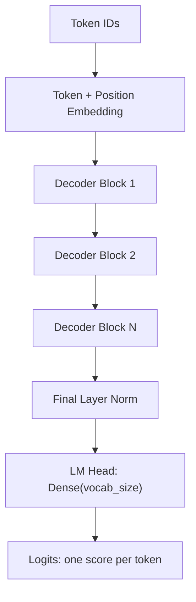

## Stack the Pieces Into a Mini-GPT

Now we connect everything: token + positional embeddings → a stack of decoder blocks → a final
linear layer (the **language-model head**) that produces a score for every token in the vocabulary.



```python
#@title Hyperparameters - these are your tuning knobs for the challenge
embed_dim     = 64      # token/position vector size  (block_size = 128 from Phase 1)
num_heads     = 4       # parallel attention heads    (must divide embed_dim)
ff_dim        = 256     # feed-forward width inside each block
num_blocks    = 4       # how many decoder blocks to stack
dropout_rate  = 0.1
learning_rate = 1e-3
```

```python
#@title Build the GPT-style model
def build_gpt():
    inputs = keras.Input(shape=(None,), dtype="int32")

    x = TokenAndPositionEmbedding(vocab_size, block_size, embed_dim)(inputs)

    for _ in range(num_blocks):
        x = DecoderBlock(embed_dim, num_heads, ff_dim, dropout_rate)(x)

    x = layers.LayerNormalization(epsilon=1e-6)(x)
    logits = layers.Dense(vocab_size)(x)        # one score per vocabulary token
    return keras.Model(inputs=inputs, outputs=logits)

model = build_gpt()
model.summary()
```

With the defaults above the summary reports **216,641 parameters**.

{}
Compare that number to reality: GPT-3 has 175 **billion** parameters — about 800,000 times more. The
architecture printed by `model.summary()` and the one inside a frontier model are the same shape;
only the numbers differ. That is genuinely the main thing separating your model from theirs, along
with the size of the corpus.
{}

{}
Notice `shape=(None,)` in the `Input`: the sequence length is left undefined. During training we feed
`block_size`-long windows, but during generation in Phase 4 we start from a prompt of just a few
characters. Leaving the length flexible lets the same model do both.
{}

## Compile With the Right Loss

We use sparse categorical cross-entropy with `from_logits=True`, because our LM head outputs raw
scores (logits), not probabilities — the loss function applies the softmax internally for numerical
stability.

```python
#@title Compile the model
loss_fn   = keras.losses.SparseCategoricalCrossentropy(from_logits=True)
optimizer = keras.optimizers.Adam(learning_rate=learning_rate)

model.compile(optimizer=optimizer, loss=loss_fn)
print("Model compiled. Ready to train.")
```

{}
`learning_rate` controls how big a step the optimizer takes when it updates weights — exactly the `α`
from the gradient-descent formula you saw in AI 301. Too high and training is unstable; too low and it
crawls. Large Transformers are usually trained around `3e-4`, but a model this small learns
considerably faster at `1e-3`, which is why that is our default. Try both in the final challenge and
compare.
{}

<!-- Renders the Mermaid diagrams on this page.
     The fortinet-hugo image sets `mermaid = false` in its generated hugo.toml, which in
     Relearn 8 disables the theme's Mermaid dependency entirely: the diagram markup is
     emitted, but no Mermaid library is ever loaded and the theme's CSS keeps every
     .mermaid block at `visibility: hidden`. Remove this block once the image is fixed. -->
<script type="module">
  import mermaid from "https://cdn.jsdelivr.net/npm/mermaid@11/dist/mermaid.esm.min.mjs";
  if (!window.__ftntMermaidLoaded) {
    window.__ftntMermaidLoaded = true;
    mermaid.initialize({ startOnLoad: false, securityLevel: "loose", theme: "default" });
    for (const el of document.querySelectorAll("pre.mermaid")) {
      try {
        await mermaid.run({ nodes: [el] });
      } catch (e) {
        console.error("Mermaid failed to render a diagram on this page:", e);
      }
      // Relearn only un-hides a diagram once its own script adds .mermaid-render.
      el.classList.add("mermaid-render");
    }
  }
</script>
