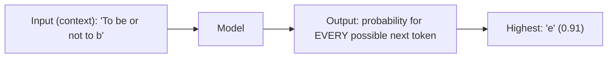

## The One Objective Behind Every LLM

An LLM is trained to do exactly one thing: **given a sequence of tokens, predict the next one.**
That's it. The astonishing range of LLM behavior — translation, summarization, coding, reasoning —
all emerges from getting very, very good at this single objective on enough data.



## Turning One Stream Into Millions of Examples

Recall we have one long array of token IDs and **no labels**. Here is the trick that creates training
data for free: slide a window of length `block_size` over the corpus. For each window, the **input**
is the window and the **target** is the *same window shifted one position to the right*. Position by
position, the target tells the model "this is the token that actually came next."

```text
context (x):  T  o     b  e     o  r
target  (y):  o     b  e     o  r     n
              ^each x position must predict the y in the same column
```

So a window of 8 tokens is really 8 prediction problems at once:

- given `T` → predict `o`
- given `T o` → predict ` `
- given `T o ` → predict `b`
- ... and so on.

The causal mask you built is what makes this safe to do in a single pass: each position can only see
its own past, so it can't cheat by reading the target.

```python
#@title Build (input, target) pairs from the corpus
block_size = 128
batch_size = 64

def get_batch(data, batch_size, block_size):
    # pick batch_size random starting points
    max_start = len(data) - block_size - 1
    starts = tf.random.uniform((batch_size,), 0, max_start, dtype=tf.int32)
    x = tf.stack([data[i : i + block_size] for i in starts])
    y = tf.stack([data[i + 1 : i + block_size + 1] for i in starts])   # shifted by 1
    return x, y

xb, yb = get_batch(data, batch_size, block_size)
print("Input  batch shape:", xb.shape)   # (64, 128)
print("Target batch shape:", yb.shape)   # (64, 128)
print("\nFirst example, decoded input :", repr(decode(xb[0][:40].numpy())))
print("First example, decoded target:", repr(decode(yb[0][:40].numpy())))
```

{}
Compare the printed input and target: the target is just the input nudged one character forward. That
one-character shift is the entire supervision signal of a language model. No humans labeled anything.
{}

## The Loss Function

For each position the model outputs a probability distribution over the whole vocabulary. We compare
it to the true next token using **cross-entropy loss** (the same loss family used for classification
in AI 101 — predicting the next token *is* a classification problem with `vocab_size` classes).

```math
$$
\mathrm{Loss} = -\frac{1}{N}\sum_{i=1}^{N} \log P_\theta(\text{true next token}_i \mid \text{context}_i)
$$
```

In words: the loss is low when the model assigned a high probability to the token that actually came
next, and high when it was "surprised." Training drives this surprise down.

{}
You may have heard the word **perplexity**. It is simply the exponential of this loss — an intuitive
measure of "on average, how many tokens is the model choosing between?" Lower perplexity = a more
confident, better language model.
{}
