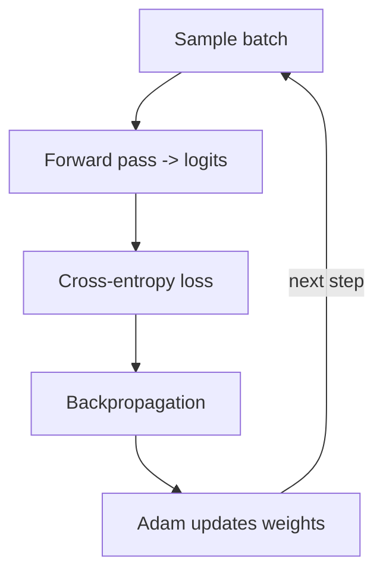

## The Training Loop

Training repeats the same loop you learned in AI 301, now applied to next-token prediction:

1. Grab a batch of `(context, target)` pairs.
2. Forward pass → logits for every position.
3. Compute cross-entropy loss against the true next tokens.
4. Backpropagation → gradients for every weight.
5. Optimizer step → nudge weights to reduce loss.
6. Repeat for many steps.



Because our batching uses random windows rather than fixed epochs over a small file, we train with a
custom step loop so you can watch the loss fall in real time.

## Measure Generalization While You Train

Training loss alone can't tell you whether the model is learning language or just memorizing the
corpus. So every few hundred steps we also measure the loss on `val_data` — text the model has never
been trained on.

```python
#@title Validation loss helper
@tf.function
def val_loss_step(x, y):
    return loss_fn(y, model(x, training=False))

def estimate_val_loss(iters=20):
    losses = [float(val_loss_step(*get_batch(val_data, batch_size, block_size)))
              for _ in range(iters)]
    return float(np.mean(losses))
```

## Run the Training

```python
#@title Train the model
steps      = 3000        # number of training steps  (a tuning knob)
eval_every = 500

@tf.function
def train_step(x, y):
    with tf.GradientTape() as tape:
        logits = model(x, training=True)
        loss = loss_fn(y, logits)
    grads = tape.gradient(loss, model.trainable_variables)
    optimizer.apply_gradients(zip(grads, model.trainable_variables))
    return loss

history = []
start = time.time()

for step in range(1, steps + 1):
    xb, yb = get_batch(train_data, batch_size, block_size)
    loss = train_step(xb, yb)

    if step == 1 or step % eval_every == 0:
        vl = estimate_val_loss()
        history.append((step, float(loss), vl))
        print(f"step {step:5d} | train {float(loss):.4f} | val {vl:.4f} "
              f"| perplexity {np.exp(vl):5.1f} | {time.time()-start:6.1f}s")

print("\n✅ Training complete.")
```

{}
**How long this takes.** Expect roughly **3-5 minutes** for 3000 steps on a Colab **T4 GPU**, and
**15-25 minutes** on **CPU only** — the exact numbers depend on which hardware Colab gives you. The
per-step time is printed in the log, so after the first evaluation line you can estimate your own
total. If you are on CPU and short on time, lower `steps` to 1500: the model will be noticeably worse
but everything else still works.

While it runs, read ahead into Phase 4. The notebook keeps training in the background.
{}

## What You Should See

Your exact numbers will differ slightly (the batches are random), but the shape of the run should
look like this:

```text
step     1 | train 4.6249 | val 4.1126 | perplexity  61.1
step   500 | train 2.1731 | val 2.1949 | perplexity   9.0
step  1000 | train 1.8820 | val 1.9371 | perplexity   6.9
step  1500 | train 1.7578 | val 1.8318 | perplexity   6.2
step  2000 | train 1.7031 | val 1.7668 | perplexity   5.9
step  2500 | train 1.6344 | val 1.7356 | perplexity   5.7
step  3000 | train 1.5814 | val 1.6940 | perplexity   5.4
```

Three things to read out of that table:

- **The validation loss starts at about 4.11.** That is essentially `ln(65) = 4.17` — the model is
  spreading its probability evenly over all 65 characters and knows nothing at all. (The step-1
  *training* number is noisier: it is a single random batch measured with dropout switched on.)
- **The loss falls fast, then slowly.** Most of the easy structure — letter frequencies, spaces, the
  most common words — is learned within the first few hundred steps. Everything after that is
  diminishing returns.
- **Train and validation loss stay close together**, with the training loss slightly ahead. That gap
  is normal and healthy. If the validation loss ever starts *rising* while the training loss keeps
  falling, you are overfitting.

## Watch the Loss Fall

```python
#@title Plot the training and validation loss
steps_x  = [h[0] for h in history]
train_y  = [h[1] for h in history]
val_y    = [h[2] for h in history]

plt.plot(steps_x, train_y, marker="o", label="train")
plt.plot(steps_x, val_y,   marker="o", label="validation")
plt.title("Loss (next-token prediction)")
plt.xlabel("Step")
plt.ylabel("Cross-entropy loss")
plt.legend()
plt.grid(True)
plt.show()
```

{}
A falling loss means the model is getting less "surprised" by the true next token — it is learning the
statistical structure of the corpus: spelling, then common words, then phrasing, then style. Early in
training the output is gibberish; by the end it produces text that looks like the corpus. You are
literally watching a foundation model form.
{}

## Save and Reload Your Foundation Model

```python
#@title Save the trained model
model.save("genai_foundation.keras")
print("[*] Saved as genai_foundation.keras")
```

Always verify that a saved model actually comes back. This works because `TokenAndPositionEmbedding`
and `DecoderBlock` both define `get_config()` and are registered as serializable — without that,
`model.save()` succeeds but `load_model()` fails later, when you have already closed the notebook.

```python
#@title Reload it and confirm the weights survived
reloaded = keras.models.load_model("genai_foundation.keras")

xb, yb = get_batch(val_data, batch_size, block_size)
print("Original loss:", float(loss_fn(yb, model(xb, training=False))))
print("Reloaded loss:", float(loss_fn(yb, reloaded(xb, training=False))))
```

Both numbers must be identical. You can download the file from the Colab file browser (folder icon in
the left sidebar) to keep your model.

{}
You have now done **Stage 1 — pre-training** from the roadmap. The trained `model` object *is* your
foundation model. In the next phase you will use it for **inference** and see how sampling choices
change what it produces — and where hallucination comes from.
{}

<!-- Renders the Mermaid diagrams on this page.
     The fortinet-hugo image sets `mermaid = false` in its generated hugo.toml, which in
     Relearn 8 disables the theme's Mermaid dependency entirely: the diagram markup is
     emitted, but no Mermaid library is ever loaded and the theme's CSS keeps every
     .mermaid block at `visibility: hidden`. Remove this block once the image is fixed. -->
<script type="module">
  import mermaid from "https://cdn.jsdelivr.net/npm/mermaid@11/dist/mermaid.esm.min.mjs";
  if (!window.__ftntMermaidLoaded) {
    window.__ftntMermaidLoaded = true;
    mermaid.initialize({ startOnLoad: false, securityLevel: "loose", theme: "default" });
    for (const el of document.querySelectorAll("pre.mermaid")) {
      try {
        await mermaid.run({ nodes: [el] });
      } catch (e) {
        console.error("Mermaid failed to render a diagram on this page:", e);
      }
      // Relearn only un-hides a diagram once its own script adds .mermaid-render.
      el.classList.add("mermaid-render");
    }
  }
</script>
