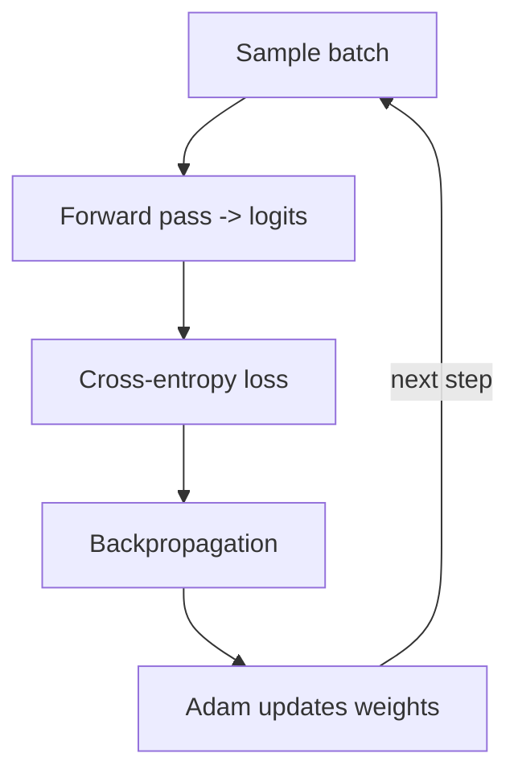

## The Training Loop

Training repeats the same loop you learned in AI 101, now applied to next-token prediction:

1. Grab a batch of `(context, target)` pairs.
2. Forward pass → logits for every position.
3. Compute cross-entropy loss against the true next tokens.
4. Backpropagation → gradients for every weight.
5. Optimizer step → nudge weights to reduce loss.
6. Repeat for many steps.



Because our batching uses random windows rather than fixed epochs over a small file, we train with a
custom step loop so you can watch the loss fall in real time.

```python
#@title Train the model
import time

steps = 3000          # number of training steps  (a tuning knob)
eval_every = 200

@tf.function
def train_step(x, y):
    with tf.GradientTape() as tape:
        logits = model(x, training=True)
        loss = loss_fn(y, logits)
    grads = tape.gradient(loss, model.trainable_variables)
    optimizer.apply_gradients(zip(grads, model.trainable_variables))
    return loss

history = []
start = time.time()
for step in range(1, steps + 1):
    xb, yb = get_batch(data, batch_size, block_size)
    loss = train_step(xb, yb)
    if step % eval_every == 0 or step == 1:
        history.append((step, float(loss)))
        print(f"step {step:5d} | loss {float(loss):.4f} | {time.time()-start:6.1f}s")

print("\n✅ Training complete.")
```

## Watch the Loss Fall

```python
#@title Plot the training loss
steps_x = [h[0] for h in history]
loss_y  = [h[1] for h in history]
plt.plot(steps_x, loss_y, marker="o")
plt.title("Training loss (next-token prediction)")
plt.xlabel("Step")
plt.ylabel("Cross-entropy loss")
plt.grid(True)
plt.show()
```

{}
A falling loss means the model is getting less "surprised" by the true next token — it is learning the
statistical structure of the corpus: spelling, then common words, then phrasing, then style. Early in
training the output is gibberish; by the end it produces text that looks like the corpus. You are
literally watching a foundation model form.
{}

{}
You have now done **Stage 1 — pre-training** from the roadmap. The trained `model` object *is* your
foundation model. In the next phase you'll use it for **inference** and see how sampling choices change
what it produces — and where hallucination comes from.
{}

## Save Your Foundation Model

```python
#@title Save the trained model
model.save("genai_foundation.keras")
print("[*] Saved as genai_foundation.keras")
```
