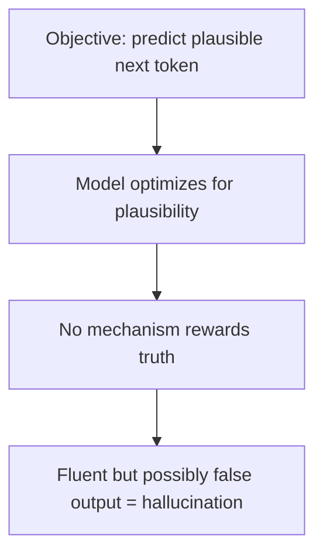
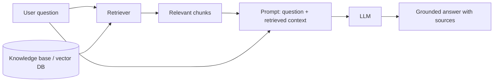

## Why LLMs Hallucinate (You Just Saw It)

The text your model generated *looked* like the corpus but wasn't *true* in any factual sense — it
invented plausible-sounding lines. That is **hallucination**: confidently producing content that is
fluent but false or unsupported.

It is not a glitch — it is the direct consequence of the training objective. The model was *only ever*
optimized to produce *plausible next tokens*, never *true* ones. It has no built-in notion of facts,
sources, or truth. It has a notion of *what text usually looks like.*

Two structural limitations make this worse:

- **Knowledge is frozen** at training time — the model knows nothing that happened after its data
  cutoff and nothing private to your organization.
- **Context window is finite** — it can't hold your entire knowledge base in the prompt.

## Grounding: Tying Output to Real Sources

**Grounding** means constraining or informing the model's output with **authoritative, external,
verifiable information** rather than relying solely on its frozen internal weights. A grounded answer
can cite where it came from. Grounding is *the* primary defense against hallucination in production
systems.

## RAG: Retrieval-Augmented Generation

**RAG** is the most common way to ground an LLM. Instead of asking the model to answer from memory,
you first **retrieve** relevant documents and **inject** them into the prompt, then ask the model to
answer *using only that provided context*.

How retrieval works, step by step:

1. **Embed** your documents into vectors (the same embedding idea from Phase 1) and store them in a
   **vector database**.
2. When a question arrives, **embed the question** too.
3. Find the document chunks whose vectors are **most similar** to the question's vector (semantic
   search — the *"king − man + woman ≈ queen"* idea you saw in AI 301, used to match meaning rather
   than keywords).
4. Paste those chunks into the prompt and instruct the model to answer from them.

{}
RAG does **not** retrain the model. The model's weights never change — you are just giving it better
*context* at inference time. This is why RAG is cheap, fast to update (change the documents, not the
model), and the default choice for "make the LLM answer questions about *our* data."
{}

## Grounding vs. Fine-tuning — Don't Confuse Them

| | Grounding / RAG | Fine-tuning |
| --- | --------------- | ----------- |
| Changes model weights? | No | Yes |
| Adds new *knowledge*? | Yes, at query time | Yes, baked in |
| Best for | Facts, current data, private docs, citations | Style, format, task behavior |
| Update cost | Edit the documents | Re-run training |
| Reduces hallucination? | Strongly | Somewhat |

{}
A useful mental model: **fine-tuning teaches the model *how to behave*; grounding/RAG tells it *what is
true right now*.** Most real systems use both — a fine-tuned model that answers from retrieved,
grounded context.
{}

## Security Angle

Because RAG injects retrieved text directly into the prompt, an attacker who can plant text in your
knowledge base (or in a web page the model reads) can attempt **prompt injection** — embedding
instructions that the model may follow. Grounding improves accuracy but expands the trust boundary to
include *every source you retrieve from*.

The reason this works at all is the mechanism you built in Phase 3: the model has **no structural
distinction between instructions and data**. Everything — system prompt, user question, retrieved
document — arrives as one flat sequence of tokens, and the model simply continues it. There is no
privilege boundary inside the context window to enforce.

{}
If you want to *exploit* this rather than just understand it, that is the whole subject of
[AI 101 - Agents, MCP & the Agentic Security Model](https://fortinetcloudcse.github.io/ai-101/index.html),
where you build an agent and then deliberately compromise it.
{}

<!-- Renders the Mermaid diagrams on this page.
     The fortinet-hugo image sets `mermaid = false` in its generated hugo.toml, which in
     Relearn 8 disables the theme's Mermaid dependency entirely: the diagram markup is
     emitted, but no Mermaid library is ever loaded and the theme's CSS keeps every
     .mermaid block at `visibility: hidden`. Remove this block once the image is fixed. -->

