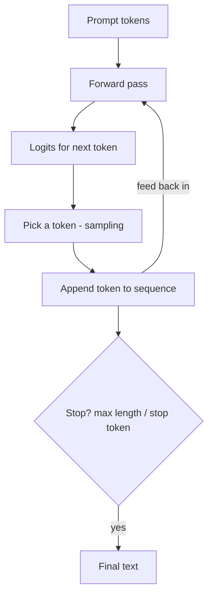

## What "Inference" Actually Means

**Inferencing** (or just *inference*) is the act of *using* a trained model to produce output — as
opposed to *training* it. Training changes the weights; inference keeps them fixed and just runs the
model forward. Every time you send a prompt to ChatGPT or Claude, that is one inference call.

For a generative model, inference is a loop:



This loop — predict, pick, append, repeat — is **autoregressive generation**. Notice the model only
ever predicts *one* token at a time; the fluent paragraphs you see are this loop running hundreds of
times, each step conditioned on everything generated so far.

## Build the Generation Function

This one function covers all three sampling strategies you will experiment with on the next page, so
copy it once and reuse it.

```python
#@title Generate text from the trained model
def generate(model, prompt, max_new_tokens=300, temperature=1.0, top_k=None, top_p=None):
    ids = encode(prompt)

    for _ in range(max_new_tokens):
        # the model can only ever see the last block_size tokens
        context = tf.constant([ids[-block_size:]], dtype=tf.int32)
        logits = np.array(model(context, training=False))[0, -1, :].astype("float64")

        # temperature 0 means "no randomness at all": always take the top token
        if temperature <= 0:
            ids.append(int(np.argmax(logits)))
            continue

        logits = logits / temperature

        if top_k is not None:                       # keep only the k highest-scoring tokens
            kth_best = np.sort(logits)[-top_k]
            logits[logits < kth_best] = -np.inf

        probs = np.exp(logits - logits.max())       # softmax, numerically safe
        probs /= probs.sum()

        if top_p is not None:                       # keep the smallest set summing to p
            order = np.argsort(probs)[::-1]
            cutoff = np.searchsorted(np.cumsum(probs[order]), top_p) + 1
            keep = np.zeros_like(probs)
            keep[order[:cutoff]] = 1.0
            probs *= keep
            probs /= probs.sum()

        ids.append(int(np.random.choice(len(probs), p=probs)))

    return decode(ids)
```

## Generate From Your Model

```python
#@title First generation
print(generate(model, prompt="ROMEO:", max_new_tokens=400, temperature=0.8))
```

Output from a model trained with the default settings looks roughly like this:

```text
ROMEO:
Good shall fair injustical unclaimes,
My fair sovertalence, the ever some of herous fanish'd
A little of coul lady!

GLOUCESTER:
Be peen, sir! on may the hearts tongue still
When of soul revenger be lord.
Will we were your for hear; the nagy.

DUKE VINCENTIO:
he lady beauty to do both back'd at hipe.

DUKE VINCENTIO:
O, cousin, sir, then myself? 'Tis love a red it,
we have all so letter the commo
```

That is not Shakespeare — but look at what a 216,641-parameter model learned from raw characters in
a few minutes:

- **real English words**, most of the time — `Good`, `fair`, `little`, `lady`, `cousin`, `myself`
- **real character names** it was never told about: `ROMEO`, `GLOUCESTER`, `DUKE VINCENTIO`
- **the layout of a play**: a name in capitals, a colon, a newline, then a few lines, then a blank
  line and the next speaker
- **grammatical shape**: articles before nouns, apostrophes in `fanish'd` and `back'd` exactly where
  Shakespearean elision puts them

It also invents words — `injustical`, `sovertalence`, `hipe` — because at 216,641 parameters it has
learned which letter *sequences* look English without having room to memorize a dictionary.

Nobody taught it any of this. Every bit of it emerged from predicting the next **character**, 3000
training steps in a row.

{}
Read the output closely. It has the *shape* of the corpus and says nothing true or even coherent.
That "looks right but isn't necessarily right" quality is the seed of **hallucination**, which we
explore in two pages.
{}

{}
Notice the line `context = ids[-block_size:]`. The model can only ever see the last `block_size`
tokens — 128 characters, here. This is the **context window** in action: anything older has fallen out
of view. It is the exact mechanism behind "the model forgot what I said earlier in a long chat", just
at a much smaller scale.
{}

{}
**Why generation feels slow.** Each new token requires a full forward pass over the whole context. Our
loop also re-computes the entire context every step. Production LLM servers avoid that with a
**KV cache**, which stores the keys and values of tokens already processed so only the new token has
to be computed. That optimization is why real chatbots stream tokens smoothly — it changes the speed,
not the output.
{}

<!-- Renders the Mermaid diagrams on this page.
     The fortinet-hugo image sets `mermaid = false` in its generated hugo.toml, which in
     Relearn 8 disables the theme's Mermaid dependency entirely: the diagram markup is
     emitted, but no Mermaid library is ever loaded and the theme's CSS keeps every
     .mermaid block at `visibility: hidden`. Remove this block once the image is fixed. -->
<script type="module">
  import mermaid from "https://cdn.jsdelivr.net/npm/mermaid@11/dist/mermaid.esm.min.mjs";
  if (!window.__ftntMermaidLoaded) {
    window.__ftntMermaidLoaded = true;
    mermaid.initialize({ startOnLoad: false, securityLevel: "loose", theme: "default" });
    for (const el of document.querySelectorAll("pre.mermaid")) {
      try {
        await mermaid.run({ nodes: [el] });
      } catch (e) {
        console.error("Mermaid failed to render a diagram on this page:", e);
      }
      // Relearn only un-hides a diagram once its own script adds .mermaid-render.
      el.classList.add("mermaid-render");
    }
  }
</script>
