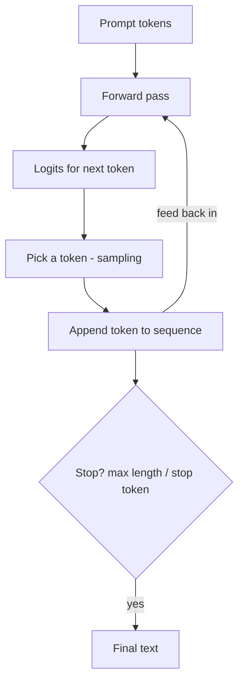

## What "Inference" Actually Means

**Inferencing** (or just *inference*) is the act of *using* a trained model to produce output — as
opposed to *training* it. Training changes the weights; inference keeps them fixed and just runs the
model forward. Every time you send a prompt to ChatGPT or Claude, that is one inference call.

For a generative model, inference is a loop:



This loop — predict, pick, append, repeat — is **autoregressive generation**. Notice the model only
ever predicts *one* token at a time; the fluent paragraphs you see are this loop running hundreds of
times, each step conditioned on everything generated so far.

## Generate From Your Model

```python
#@title Generate text from the trained model
def generate(model, prompt, max_new_tokens=300, temperature=1.0, top_k=None):
    ids = encode(prompt)
    for _ in range(max_new_tokens):
        # only the last block_size tokens fit in the context window
        context = tf.constant([ids[-block_size:]], dtype=tf.int32)
        logits = model(context, training=False)
        logits = logits[0, -1, :] / temperature      # logits for the next token only

        if top_k is not None:
            values, _ = tf.math.top_k(logits, k=top_k)
            min_keep = values[-1]
            logits = tf.where(logits < min_keep, tf.fill(logits.shape, -1e9), logits)

        probs = tf.nn.softmax(logits).numpy()
        next_id = np.random.choice(len(probs), p=probs)
        ids.append(int(next_id))
    return decode(ids)

print(generate(model, prompt="ROMEO:", max_new_tokens=400, temperature=1.0))
```

{}
The first time you run this, read the output closely. Even a tiny model trained for a few minutes
produces text with the *shape* of the corpus — character names, line breaks, archaic vocabulary —
even if it's nonsense. That "looks right but isn't necessarily true" quality is the seed of
hallucination, which we'll explore in two pages.
{}

{}
Notice the line `context = ids[-block_size:]`. The model can only ever see the last `block_size`
tokens. This is the **context window** in action — anything older than that has fallen out of view.
This is the exact mechanism behind "the model forgot what I said earlier in a long chat."
{}
