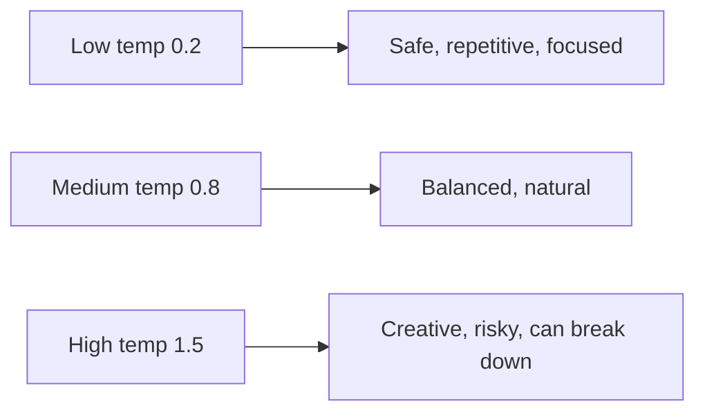

## The Model Gives Probabilities — *You* Choose How to Pick

At each step the model outputs a probability for every possible next token. How you *choose* from
that distribution dramatically changes the output. This choice is **sampling**, and three knobs
control it.

### Greedy / Temperature

**Temperature** rescales the probabilities before sampling.

- **Low temperature (→ 0):** the distribution sharpens; the model almost always picks the single most
  likely token. Output is focused, repetitive, deterministic. (Temperature 0 = pure greedy.)
- **High temperature (→ 1.5+):** the distribution flattens; unlikely tokens get a real chance. Output
  is creative, surprising, and eventually incoherent.

```math
$$
P_i = \frac{\exp(\text{logit}_i / T)}{\sum_j \exp(\text{logit}_j / T)}
$$
```



### Top-k

**Top-k** keeps only the `k` most likely tokens and zeroes out the rest before sampling. It prevents
the model from ever picking a truly bizarre token, while still allowing variety among the plausible
ones. `top_k = 40` is a common value.

### Top-p (nucleus sampling)

**Top-p** keeps the smallest set of tokens whose probabilities *add up to p* (e.g. 0.9), then samples
from that set. Unlike top-k's fixed count, the set size adapts: when the model is confident, few
tokens qualify; when uncertain, more do. This is the most widely used method in production.

## Experiment

```python
#@title Compare sampling settings
print("=== temperature=0.2 (focused) ===")
print(generate(model, "ROMEO:", max_new_tokens=200, temperature=0.2))

print("\n=== temperature=0.8 (balanced) ===")
print(generate(model, "ROMEO:", max_new_tokens=200, temperature=0.8))

print("\n=== temperature=1.4 (wild) ===")
print(generate(model, "ROMEO:", max_new_tokens=200, temperature=1.4))

print("\n=== temperature=0.8 + top_k=20 ===")
print(generate(model, "ROMEO:", max_new_tokens=200, temperature=0.8, top_k=20))
```

{}
Run this a few times. Low temperature loops and repeats; high temperature dissolves into noise;
medium temperature with top-k tends to read best. There is no universally "correct" setting — chatbots
favor low-to-medium temperature for reliability, while creative writing tools use higher values. This
is a *product* decision, not a model property.
{}

{}
**Why outputs differ each run:** sampling is random by design. Two identical prompts can produce
different answers unless temperature is 0 or a fixed random seed is set. This non-determinism is
intrinsic to how generative models are *used*, not a bug.
{}
