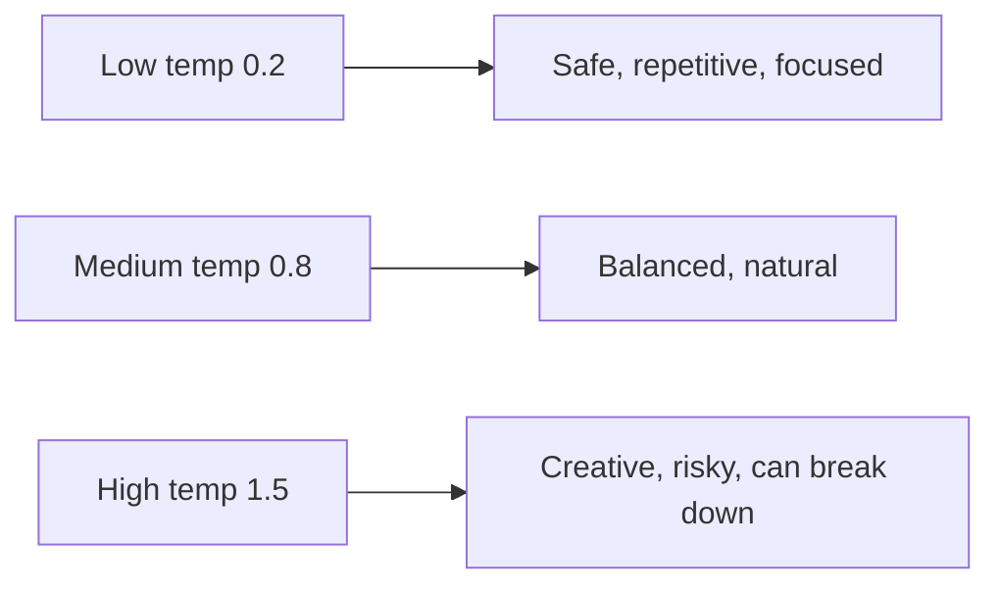
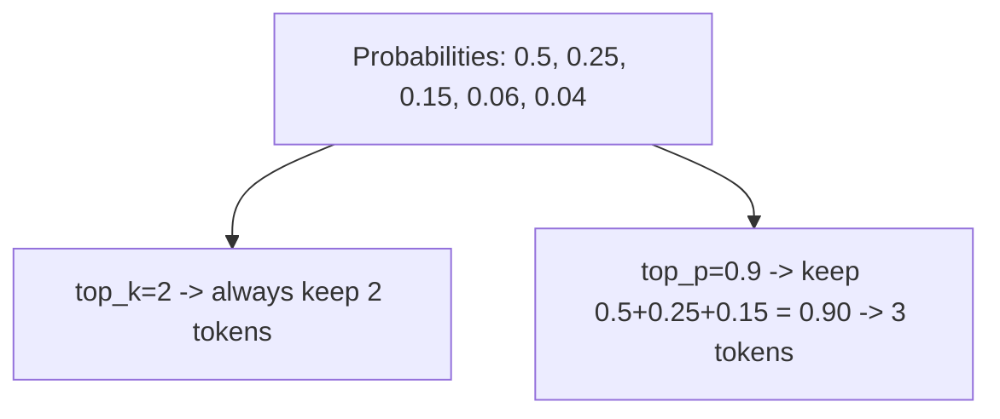

## The Model Gives Probabilities — *You* Choose How to Pick

At each step the model outputs a probability for every possible next token. How you *choose* from
that distribution dramatically changes the output. This choice is **sampling**, and three knobs
control it.

### Greedy / Temperature

**Temperature** rescales the probabilities before sampling.

- **Low temperature (→ 0):** the distribution sharpens; the model almost always picks the single most
  likely token. Output is focused, repetitive, deterministic. (Temperature 0 = pure greedy.)
- **High temperature (→ 1.5+):** the distribution flattens; unlikely tokens get a real chance. Output
  is creative, surprising, and eventually incoherent.

```math
$$
P_i = \frac{\exp(\text{logit}_i / T)}{\sum_j \exp(\text{logit}_j / T)}
$$
```



### Top-k

**Top-k** keeps only the `k` most likely tokens and zeroes out the rest before sampling. It prevents
the model from ever picking a truly bizarre token, while still allowing variety among the plausible
ones. `top_k = 40` is a common value.

### Top-p (nucleus sampling)

**Top-p** keeps the smallest set of tokens whose probabilities *add up to p* (e.g. 0.9), then samples
from that set. Unlike top-k's fixed count, the set size adapts: when the model is confident, few
tokens qualify; when uncertain, more do. This is the most widely used method in production.



Temperature, top-k and top-p are not alternatives — they stack. A common production default is
`temperature≈0.7` with `top_p=0.9`.

## Experiment

```python
#@title Compare sampling settings
settings = [
    ("greedy (temperature=0)",   dict(temperature=0.0)),
    ("focused (0.2)",            dict(temperature=0.2)),
    ("balanced (0.8)",           dict(temperature=0.8)),
    ("wild (1.4)",               dict(temperature=1.4)),
    ("0.8 + top_k=20",           dict(temperature=0.8, top_k=20)),
    ("0.8 + top_p=0.9",          dict(temperature=0.8, top_p=0.9)),
]

for label, kwargs in settings:
    print("=" * 70)
    print(f"### {label}")
    print(generate(model, "ROMEO:", max_new_tokens=200, **kwargs))
```

Here is what the same trained model produced for each setting:

```text
### greedy (temperature=0)
ROMEO:
The will the shall the stand the shall the shall the shall be the stand
The shall the shall the stand the stress of the straight.

### focused (0.2)
ROMEO:
And the shall the command the comman the with man the such of the for the country.

### balanced (0.8)
ROMEO:
Went thee this of His swords, I procloud,
We a malieven that with flace with beast no made;
That he senation the for the lard's help the bagin.

### wild (1.4)
ROMEO:
Tell; beg; goved last't, as very-me!
No.
Think odyers Buchilister.
Coth
Meta, Must thrieves, true, good.

### 0.8 + top_k=20
ROMEO:
Or well the that, instand of your will dread stand
Of the patien the livens to desire.

### 0.8 + top_p=0.9
ROMEO:
Sir, sir, I have me the was to love?

CATESBY:
Marcely, we they lord, lord, more, and face
```

| Setting | What happened |
| ------- | ------------- |
| `temperature=0` | Locked into `the shall the shall` and never escaped |
| `temperature=0.2` | Still heavily repetitive — `the shall the command the comman` |
| `temperature=0.8` | The best balance: varied, mostly real words, play-like phrasing |
| `temperature=1.4` | Broken spelling and invented words — `odyers`, `thrieves`, `Buchilister` |
| `top_k=20` | Like 0.8, but never picks a truly bizarre character |
| `top_p=0.9` | Like top-k, but the cut-off adapts to the model's confidence |

{}
The repetition at `temperature=0` is worth understanding, because it is not a bug in your model. Once
greedy decoding enters a state whose most likely continuation loops back to that same state, nothing
can break the cycle — the choice is deterministic. This is exactly why production systems almost never
use pure greedy decoding for open-ended text.
{}

{}
Run this a few times. Low temperature loops and repeats; high temperature dissolves into noise;
medium temperature with top-k tends to read best. There is no universally "correct" setting — chatbots
favor low-to-medium temperature for reliability, while creative writing tools use higher values. This
is a *product* decision, not a model property.
{}

{}
**Why outputs differ each run:** sampling is random by design. Two identical prompts can produce
different answers unless temperature is 0 or a fixed random seed is set. This non-determinism is
intrinsic to how generative models are *used*, not a bug.
{}

<!-- Renders the Mermaid diagrams on this page.
     The fortinet-hugo image sets `mermaid = false` in its generated hugo.toml, which in
     Relearn 8 disables the theme's Mermaid dependency entirely: the diagram markup is
     emitted, but no Mermaid library is ever loaded and the theme's CSS keeps every
     .mermaid block at `visibility: hidden`. Remove this block once the image is fixed. -->
<script type="module">
  import mermaid from "https://cdn.jsdelivr.net/npm/mermaid@11/dist/mermaid.esm.min.mjs";
  if (!window.__ftntMermaidLoaded) {
    window.__ftntMermaidLoaded = true;
    mermaid.initialize({ startOnLoad: false, securityLevel: "loose", theme: "default" });
    for (const el of document.querySelectorAll("pre.mermaid")) {
      try {
        await mermaid.run({ nodes: [el] });
      } catch (e) {
        console.error("Mermaid failed to render a diagram on this page:", e);
      }
      // Relearn only un-hides a diagram once its own script adds .mermaid-render.
      el.classList.add("mermaid-render");
    }
  }
</script>
