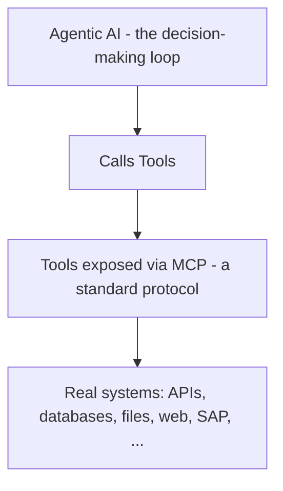
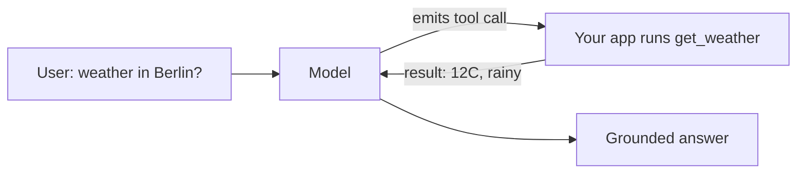
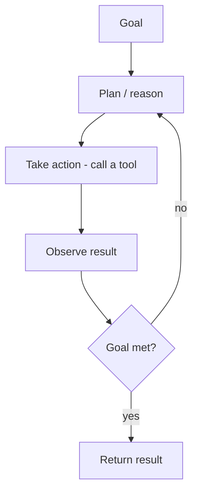
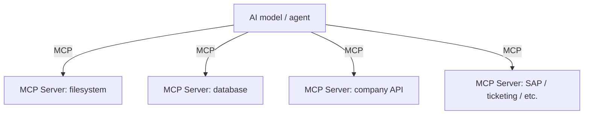

These three terms are the most frequently muddled in GenAI discussions. Here is the clean hierarchy:
**tools** are capabilities a model can call; an **agent** is a model that decides *when and how* to
call them in a loop; **MCP** is a standard *protocol* for connecting models to tools. They are
different layers, not synonyms.

## Tools (a.k.a. Function Calling)

A plain LLM can only produce text. A **tool** is an external capability — a function, API, database
query, web search, code execution — that the model can *invoke* to act on the world or fetch fresh
information.

Mechanically, the model doesn't run the tool itself. It emits a structured request ("call
`get_weather(city='Berlin')`"), your application runs the function, and the **result is fed back into
the model's context** so it can use it in its next response. This is also called **function calling**.

{}
Tools are how an LLM overcomes its two core limits: frozen knowledge (a search or DB tool fetches
current data) and inability to act (an API tool lets it *do* things). A tool result entering the
context is itself a form of **grounding**.
{}

## Agentic AI

**Agentic AI** describes systems where the model doesn't just answer once, but operates in a **loop**:
it plans, takes an action (often a tool call), observes the result, and decides the next step — until
a goal is reached. The model is given *autonomy over the sequence of steps*.

The difference from a normal chatbot:

| | Chatbot (single-shot) | Agent (loop) |
| --- | -------------------- | ------------ |
| Steps | One prompt, one answer | Many steps, self-directed |
| Tools | Usually none | Central |
| Decides next action? | No | Yes |
| Example | "Summarize this" | "Find the failing host, read its logs, open a ticket" |

{}
"Agentic" is a spectrum, not a binary. Adding a single tool call to a chatbot is mildly agentic;
a system that plans a multi-step task, calls several tools, recovers from errors, and decides when it's
done is strongly agentic. Be skeptical when a product calls itself "an agent" — ask *how much autonomy
over the action sequence it actually has.*
{}

## MCP — Model Context Protocol

**MCP (Model Context Protocol)** is an **open standard for connecting AI models to tools and data
sources**. Before MCP, every team wrote bespoke glue to wire a model to each API, database, or app —
an N×M integration problem. MCP defines a common interface so any MCP-compatible model can talk to any
MCP-compatible tool or data server.

The analogy that lands well: **MCP is to AI tools what USB-C is to devices** — one standard plug
instead of a different cable for every device. An **MCP server** exposes a tool or data source; an
**MCP client** (inside the model's host application) consumes it.

{}
Key distinction to hammer home: **MCP is a *protocol*, not a model, not an agent, and not a tool
itself.** It is the *standardized way* an agent reaches tools. You can have tools without MCP (custom
function calling) and agents without MCP — MCP just makes the connections interoperable and reusable.
{}

## How They Stack Together

A realistic modern GenAI application:

1. A **foundation model** provides the core language ability.
2. **Fine-tuning / RLHF** made it a helpful, well-behaved assistant.
3. **RAG / grounding** feeds it current, authoritative context.
4. **Tools** let it fetch data and take actions.
5. **MCP** standardizes how those tools are connected.
6. **Agentic** orchestration lets it chain all of the above toward a goal.

{}
If your colleagues remember one slide, make it this one: **Foundation model = the brain. Fine-tuning =
its training/manners. RAG = giving it the right reference documents. Tools = its hands. MCP = the
standard sockets its hands plug into. Agent = letting it decide what to do next.**
{}

{}
**Want to build one?** [AI 101 - Agents, MCP & the Agentic Security Model](https://fortinetcloudcse.github.io/ai-101/index.html)
is the hands-on counterpart to this page: you build an HR assistant, wire it to tools and an MCP
server, and then attack it. This lab explains the engine; that lab builds the car and crashes it on
purpose.
{}

<!-- Renders the Mermaid diagrams on this page.
     The fortinet-hugo image sets `mermaid = false` in its generated hugo.toml, which in
     Relearn 8 disables the theme's Mermaid dependency entirely: the diagram markup is
     emitted, but no Mermaid library is ever loaded and the theme's CSS keeps every
     .mermaid block at `visibility: hidden`. Remove this block once the image is fixed. -->

