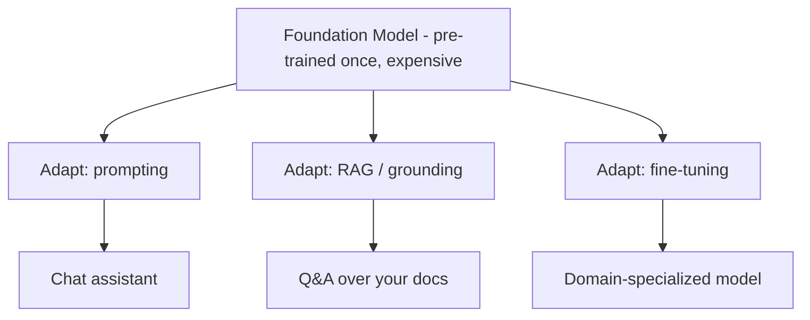

## Foundation Model

A **foundation model** is a large model pre-trained on broad data that serves as a reusable *base* for
many downstream tasks. The tiny GPT you trained in Phase 3 is, in miniature, a foundation model: a
general next-token engine not yet specialized for any particular use.

The term captures a shift in how AI is built. Instead of training a new model per task (one for spam,
one for translation, one for summaries), you train **one** expensive general model and then *adapt* it
many cheap ways.

Examples of foundation models: the GPT family, Claude, Gemini, Llama, Mistral. They share the
decoder-only Transformer architecture you built — differing in scale, data, and alignment.

## Three Ways to Adapt a Foundation Model (Cheapest → Most Involved)

### 1. Prompting / In-context learning

Just write a good prompt. The model "learns" from examples *inside the prompt* without any weight
change. **Few-shot prompting** = showing a few examples in the prompt. This is instant and free but
limited by the context window.

### 2. Grounding / RAG

Inject retrieved, authoritative context at inference time (Phase 4). No weight change. Best for facts
and private/current data.

### 3. Fine-tuning

Continue training the foundation model on task-specific data so the new behavior is baked into the
weights. Best for consistent *style*, *format*, or *task behavior* that prompting can't reliably
achieve.

Common fine-tuning flavors:

- **Supervised Fine-Tuning (SFT):** train on *(prompt → ideal response)* pairs.
- **Parameter-Efficient Fine-Tuning (PEFT) / LoRA:** train only a small number of added parameters
  instead of all of them — far cheaper, the standard approach today.
- **RLHF / preference tuning:** align the model with human preferences for helpfulness and safety.
  This is the step that turns a raw text-completer into a helpful assistant.

{}
**The decision tree most teams actually use:**
Start with **prompting**. If the model lacks knowledge → add **RAG**. If it lacks a consistent
*behavior or style* → **fine-tune**. Reach for full pre-training only if you are building a foundation
model from scratch — which, as Phase 3 showed, is conceptually simple but practically enormous at
scale.
{}

{}
Common misconception to clear up for your audience: *"We need to fine-tune the model on our data so it
knows our products."* Usually false. If the need is **factual recall of your data**, RAG is cheaper,
more up-to-date, and less error-prone. Fine-tuning is for *behavior*, not for *facts*.
{}

<!-- Renders the Mermaid diagrams on this page.
     The fortinet-hugo image sets `mermaid = false` in its generated hugo.toml, which in
     Relearn 8 disables the theme's Mermaid dependency entirely: the diagram markup is
     emitted, but no Mermaid library is ever loaded and the theme's CSS keeps every
     .mermaid block at `visibility: hidden`. Remove this block once the image is fixed. -->

